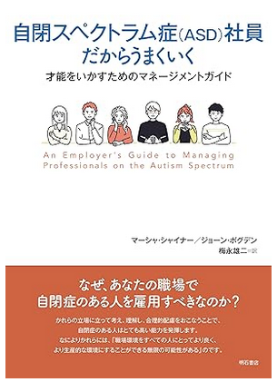

# MASD(Middle ASD)向けサバイバルガイド
[日本語](index.md) | [English](index_EN.md) | [GitHub](https://github.com/stakiran/middle-asd-survival-guide)

# (目次)
<!-- toc -->
- [MASD(Middle ASD)向けサバイバルガイド](#masdmiddle-asd向けサバイバルガイド)
- [(目次)](#目次)
- [はじめに](#はじめに)
    - [背景](#背景)
    - [用語定義](#用語定義)
    - [対象読者](#対象読者)
    - [注意事項](#注意事項)
- [MASD の定義](#masd-の定義)
    - [MASD](#masd)
    - [MASD かどうかを判定する](#masd-かどうかを判定する)
- [特性と方針を理解する](#特性と方針を理解する)
    - [ASD の特性](#asd-の特性)
    - [MASD の特性、に入る前に](#masd-の特性に入る前に)
    - [MASD の特性](#masd-の特性)
    - [MASD の立ち回り（方針）](#masd-の立ち回り方針)
- [法と制度について知る](#法と制度について知る)
    - [法律](#法律)
    - [会社の制度](#会社の制度)
    - [社外の制度](#社外の制度)
    - [戦略](#戦略)
    - [(余談) 筆者の実体験](#余談-筆者の実体験)
    - [(余談) 理不尽なわがままとはどれくらい？](#余談-理不尽なわがままとはどれくらい)
- [診断書について知る](#診断書について知る)
    - [診断のバリエーション](#診断のバリエーション)
    - [診断方法](#診断方法)
    - [診断書の効力とメンテナンス](#診断書の効力とメンテナンス)
- [自分の傾向を知る](#自分の傾向を知る)
    - [詳しめの書籍を読む](#詳しめの書籍を読む)
    - [論文は読まなくていい](#論文は読まなくていい)
    - [社会的な経験を積む](#社会的な経験を積む)
    - [振り返りをする](#振り返りをする)
    - [余裕と健康を恒常的に確保する](#余裕と健康を恒常的に確保する)
    - [●](#)
- [個別的配慮を勝ち取る](#個別的配慮を勝ち取る)

# はじめに

## 背景
2026 年 1 月現在でも、ニューロダイバシティの啓蒙はイマイチです。特に苦しいのが ASD のうち、性能が高くもなく低くもない層でしょう。性能の高さで補うこともできませんし、性能が低すぎるわけでもないので障害者向けの水準と生活で満足することもできません。しかし、マジョリティである定型発達らの集団と規範に適応するのは不可能か、困難か、あるいはできたとしても著しく消耗します。

ニューロダイバーシティには以下三つのアプローチがすべて必要と考えます。

- 1: マジョリティ側、特にマネジメントやリードを行う者がニューロダイバージェントを **上手く使う** こと
- 2: 同上、1: を行うだけのメリットがニューロダイバージェントにあることを示すこと
- 3: ニューロダイバージェント自身が、自身の特性およびニューロダイバシティの現状について理解し、先手を打って立ち回ることで自己防衛すること

本書では 3: を取り扱います。1: と 2: については[拙作](https://github.com/stakiran/asdm_public)をご覧ください（日本語のみ）

## 用語定義
- **定型発達（ニューロティピカル）**
    - ニューロダイバージェントでない者を指します
    - 通常はどの文脈においても圧倒的なマジョリティです
- **ニューロダイバージェント**
    - ASD、ADHD、LD など発達障害者を指します
    - 障害ではなく特性（脳の性質）が違うと考え、多様性の一つとして捉え直した言葉です
- **ニューロダイバーシティ**
    - 多様性の概念を、発達障害者に対しても適用したものです
- **合理的配慮**
    - 細かい定義は国により異なりますが、障害者に対して個別に特殊な配慮を行うことを指します
    - 障害者の言いなりになるという意味ではなく、双方すり合わせるニュアンスがあります
    - **ニューロダイバージェントにも適用できますが、概念として古いため本書では使いません**
- **個別的配慮（Individualized Accomodation）**
    - 合理的配慮の代わりに、筆者が提唱する概念です
    - 合理的配慮は **規範ドリブン** であり、まず規範に従うことを前提とした上で、障害者向けの個別の配慮を消極的に検討します
    - 一方、個別的配慮とは **例外ドリブン** であり、まず対象者を最初から特別扱いにすると捉える上で、規範にどれだけ沿うか、どのように沿うかを積極的に検討します

## 対象読者
**性能が高くも低くもない ASD 自身**。

定義は後で述べますが、このような ASD を MASD（Middle ASD）と呼ぶことにします。本書は MASD の、MASD による、MASD のためのサバイバルガイドです。MASD が、この不十分な社会で生きていくためのヒントを提示します。

より具体的には、以下が当てはまるほど有意義な可能性が高いでしょう:

- MASD である
- ホワイトワーカーやデスクワーカーである
- 会社員である
- 日本に住んでおり、日本語で生活している

しかし、これらに当てはまらない読者にとっても有意義になると信じています。特定の文化、業界、組織に立ち入ることはせず、万人が参考にできるよう、本書はできるだけ汎用的かつ簡潔に整理されています。

## 注意事項
- 本書は筆者個人の見解であり、組織の見解ではありません
- 本書の運用により生じた、いかなる損害についても、筆者は一切の責任を負いません

# MASD の定義

## MASD
**MASD（Middle ASD）** とは、性能が高くも低くもない ASD を指します。

## MASD かどうかを判定する
まず以下の判定 1 は必ずクリアせねばなりません。クリアしない者は MASD ではありません。

- 1: ASD の診断書を持っている

診断書を持っていない人は、まずは入手してください。自己診断でも構いませんが、本書は診断書を持つ ASD が、それを開示した上での立ち回りを前提としています。診断については[診断方法を知る](#診断方法を知る)の章でも扱っています。

次に、以下判定項目に当てはまるものが多いほど MASD と言えます。本来なら「性能」を厳密に定義するべきですが、困難でしたので、このように判定項目を容易しました。MASD であれば全部か、少なくとも過半数は当てはまるはずです。当てはまらない場合、あなたは MASD ではないか、MASD かどうか判断できるだけの人生を過ごしていません。

- 1: 成人である
- 2: IQ が 86 以上、114 以下である
- 3: 入社して 5 年以上経過しているのに、一度も昇進したことがない
- 4: 以下をすべて満たす
    - パートナーがいない時期が 10 年以上ある。または容易に達成できそうである
    - 二人きりで数時間以上、無目的に過ごす機会を 2 回以上おくれる友達が 10 年以上いない。または容易に達成できそうである
- 5: 受験やオンラインゲームなど全国的に万人以上存在する実践者と競う世界において、「本格的な取り組み」をしているのに偏差値 50 を超えられない。あるいは稼働初期は超えられるが、3 年以内に実践者のレベルが上がってしまい 50 を下回るようになる
    - ※本格的な取り組みとは: 月30時間以上を費やすこと、勉強をすること、それのために生活の改善を継続的に行うことの三点がすべて当てはまること。当てはまらない月があっても良いが、当てはまる月の方が多い

# 特性と方針を理解する
自分の特性について理解してください。理解できていれば対処もしやすいです。

## ASD の特性
**運動神経ならぬ認知神経に障害がある**、と考えてください。

運動神経は運動能力を司る根幹です。ここに障害があると、マジョリティが問題なく行える運動――数十段以上の階段を行き来する、30 分以上継続して歩く、自転車に乗る、自動車を運転する、球技で遊ぶといったことすら行えません。努力しても行えないか、行うことはできるが人一倍の努力量を要します。

ASD は、一言で言えばその認知能力バージョンです。本書では **比喩的に認知神経と呼んでいます**。ASD は認知能力を司る根幹に障害があると考えます。ASD はマジョリティが問題なく行える認知的な発揮――たとえば以下のようなことができません:

- 非言語的かつ口頭ベースのコミュニケーションを 30 分以上処理する
- 様々な音が入り乱れる中で目の前の相手の発話だけ聞き取る
- 無理にルーティンやマイルールをつくらずその場の状況に素早く適応する
- 1日3食を食べず2000kcalも摂取していないのに仕事も趣味も人付き合いもこなす
- 複数の仕事を同時に進行できる（マルチタスクができる）
- 仕事で昇進するほど成果を出し、プライベートでも家庭を持ち、遊びに行ける友達もいるという三つの営みを入手し維持する

これらは努力、経験、知識の不足ではなく **性能の不足** によるものです。そしてその性能は認知神経から来ており、神経は鍛えることができません。どうしようもありません。一方で社会は **定型発達の認知神経水準が前提となっており**、ASD にも当たり前のように要求してきます。どうしようもないのに。

## MASD の特性、に入る前に
MASD の話に入る前に、その上下の話をしましょう。

ASD のうち、性能が高い者（HASD, High ASD）は特に困りはしません。あるいは容易に打開できます。たとえば IQ が高い ASD は定型発達以上に定型発達的な振る舞いを模倣できます。頭の処理能力でゴリ押しできてしまうのです。実際に HASD は MASD の定義にあてはまらず、平然と昇進していたりパートナーがいたり、燃費も良くて四六時中読書や趣味に没頭できたりします。

運動でたとえるなら、仮に片脚が無かったとしても、残る脚で 10 メートルのジャンプを 100 回、2 メートルのジャンプを 1000 回、50 cm のジャンプを 10000 回行える体力があったのなら生活などどうとでもカバーできるわけです。あるいはお金でたとえるなら、障害はあるが 10 億円を持っているようなものです。**性能があれば正直言ってどうとでもなる** わけです。

逆に ASD のうち性能が低い者（LAST, Low ASD）は、自律的に生活することすら困難でしょう。たとえば IQ が 80 以下の ASD が一人暮らしをしつつ、正社員として勤め続けるのは難しいと思います。このレベルの者は通常、両親の庇護下のもと、診断書のみならず障害者手帳も取得した上で庇護的に生きます。

両親側の経済力や忍耐力次第ですが、日本では比較的制度も整っており、このような暮らしであれば問題なく過ごせます。**だからといって MASD も同じように過ごせるかというと、いいえです**。MASD は LASD よりは性能が高く、つまりは高い水準にいます。

さて、ある水準にいる状態で、より低い水準が強要されることは（仕事の文脈では）ハラスメントと呼べるほど暴力的な行為です。絶対に許してはいけません。スマホや乗り物を使っている現代人に一切使うな、と言えるでしょうか。暴力的です。ゆえに MASD に LASD の生き方を薦めること自体が暴力的なことなのです。

## MASD の特性
上記を踏まえた上で、MASD の特性に入りましょう。

次の二点です:

- HASD のように性能でカバーできません
- LASD のような低水準で生きるわけにもいきません（そもそも許してはいけません）

これらは信念や戦略ではなく、特性であると理解してください。MASD は HASD のようにはなれませんし、LASD のように水準を下げるのも違います。あなたの周囲のマジョリティは、おそらく LASD 側を勧めてくるでしょうが、決して相手にしてはなりません。

MASD は HASD でもないし LASD でもない。ゆえにどちらの生き方もできない。

と、そう捉えるべきです。実際そうなのですから。ニューロダイバシティはまだまだ不十分であり、日本ではダイバシティの取り組みで表彰されるほどの大企業ですら、この程度も理解していません。それが現実です。厳しい現実です。

ゆえに、あなた自身が毅然と立ち回るしかないのです。そのための基礎が、**MASD は特性であってどうにかできるものではないのだ** と割り切ることです。

## MASD の立ち回り（方針）
ASD の特性は認知神経障害であり、MASD の特性は「HASD でも LASD でもない」でした。これらを踏まえた上で、では MASD はどう立ち回ればいいでしょうか。

方針は明確で、**定型発達向けの水準への適応をできるだけ回避すること** です。

用語を一つ導入しますが、定型発達向けの水準を **ティピカル・レベル** と呼ぶことにします。厳密な定義はしません。主観的に捉えて良いです。

例は挙げましょう。たとえば毎日同僚と一緒に食べること、月に 2-3 回存在する業務時間後の飲み会やイベントに参加すること、毎日 3 時間以上を会議や雑談に充てることなどはすべてティピカルレベルになるでしょう。これらは定型発達の認知神経があるからこそできることであって、ASD にできることではありません。あるいは、できても極めて高負荷です。

しかし、定型発達にとってティピカル・レベルは「当たり前にこなせるもの」です。また、円滑な組織運営のための営みでもあるので「とりあえず従うべきもの」でもあります。なので「こなせないことはありえない」とみなします。ですので、MASD 自身が回避しなければなりません。

回避にも色々あります。というより、あらゆる行動が対象です。事前に備えたり、近づかないようにしたり、速やかに距離を取ったり、もちろん主張したり衝突したりといったこともします。残念なことに、どれも **よくあります**。よくあるのです。

別の言い方をしましょう。**MASD は戦わなければなりません**。

ティピカル・レベルを言語化し、なぜそれができないかも言語化して、必要なら ASD であることもカミングアウトした上で、粘り強く主張して戦わねばなりません。もちろん、戦わずに済ませられるならそれでもいいですが、仕事の文脈だとおそらく難しいでしょう。**仕事は本質的にコミュニケーションが密になりやすい営みであり、したがって MASD の欠陥は露呈します**。

戦えば個別的配慮を勝ち取れる可能性がありますが、**戦わなければ死にます**。ティピカル・レベルという無理難題を突きつけられる構図なので、勝ち目はありません。短期的か、少なくとも中長期的に死にます。解雇されるでしょうし、その前段階で精神的に疲弊するでしょう。うつ病など二次障害に至ることもあります。ひどい場合はイジメなど暴力的な被害を被ることもあります。

大げさに聞こえるでしょうか。そうではありません。MASD の皆さんなら、現実はそんなに甘くないことはすでに理解しているかと思います。歴史的には一部の人種や性別のマイノリティ達が戦ってきましたし、今も戦っていますが、構図としてはこれと同じです。MASD は圧倒的に劣勢で、差別される側のマイノリティなのです。だからこそ、戦わねばなりません。

無論、戦ったから勝つというわけでもなく、基本的には難しい戦いなので、戦い方はよく考える必要があります。通常は真っ向から戦うよりも逃げた方が被害が少なくて済みます。真っ向から戦うのは、たとえば次のようなクリティカルな状況のときです――個別的配慮が不足しているせいでパフォーマンスを出せていないだけなのに解雇されそうである。明らかに評価が不当であり給与にも反映されず生活に響く。持続的に働けないレベルの負荷を強調されている。イジメやハラスメントを受けている。

この理不尽な社会を、一気に生き抜いていきましょう。本ガイドはそのための武器――知識と勇気を授けます。

# 法と制度について知る
法や制度を知っておくと、戦う上で有利になります。

## 法律
日本の話をします。他国の方は各自調べてください。

キーワードは二つあります。

一つ目は合理的配慮であり、企業には合理的配慮を行う義務があります。発達障害も対象です。

二つ目はオープン就労とクローズ就労です。オープン就労とは障害があることを会社に正式に届け出た上で、一般枠ではなく障害者枠で働く形態を指します。障害者枠だけあって配慮は大きいですが、仕事は単調ですし給料も低いです。

参考:

- 合理的配慮について
    - [合理的配慮指針.pdf](https://www.mhlw.go.jp/file/06-Seisakujouhou-11600000-Shokugyouanteikyoku/0000082153.pdf)
    - [雇用分野における障害者への差別禁止・合理的配慮｜厚生労働省](https://www.mhlw.go.jp/stf/seisakunitsuite/bunya/koyou_roudou/koyou/shougaishakoyou/shougaisha_h25/index.html)
- 2024年から合理的配慮の提供が義務化
    - [リーフレット「令和６年４月１日から合理的配慮の提供が義務化されました」 - 内閣府](https://www8.cao.go.jp/shougai/suishin/sabekai_leaflet-r05.html)
    - [事業者による障害のある人への「合理的配慮の提供」が義務化 - 政府広報オンライン](https://www.gov-online.go.jp/article/202402/entry-5611.html)

残念なことに、現代の合理的配慮はオープン就労とセットで行われることが多いです。すでに述べたとおり、MASD は LASD ではないので **オープン就労に就くべきではありません**。定型発達と同様、一般枠で働く（クローズ就労）前提で、その上で合理的配慮を要求してください。

なお、本書では個別的配慮という言い方をしていますが、この造語は通じないので、主張時は「合理的配慮」を使った方がいいでしょう。

## 会社の制度
会社の制度として確認しておきたいのは **通報の窓口と方法** です。

ポイントは次の二点です:

- 1: 上司や所属部門以外の、相談窓口を押さえておく
- 2: 内部通報の窓口と通報方法を押さえておく

個別的配慮を勝ち取るには、より強い圧力が必要です。まずは 1: のとおり、自分の所属部門以外の窓口を調べて、押さえてください。たとえば人事部や労働組合や I&D 部門などがありえます。規模の小さな会社だとないかもしれませんが、従業員 1000 人以上の大企業になると、おそらくあるはずです。全部門や全社員を調べられるシステムや情報をくまなく見て調べてください。

しかし、1: は会社側の人間であり、アテにならないことも多いです。そこで使いたいのが **内部通報** です。内部通報とは会社が設置した通報窓口に通報を行うというもので、主用途やハラスメントや不正会計の通報ですが、人権侵害も可能です。つまり人権侵害の一種として「合理的配慮不足」を通報します。無論、内部通報も会社が用意したものであり、1: と同様、アテにならない可能性もありますが、近年では社外機関に委託しているものもあり、まだ機能している可能性が高いです。

通報の際は、詳細な状況の提出が（テキストで）求められますので、日頃から記録しておきましょう。通報に添付するログの書き方は ChatGPT にも頼れます。時系列的に、誰が何をしてどうなったかを記録するだけです。感情や日記は抜きにして、事実を淡々と書きます。特に、いつ合理的配慮としてこれこれの提案を誰々にしたが、誰々は対応しなかった、のような「配慮不足のイベント」を貯めるといいでしょう。

## 社外の制度
筆者も使ったことはありませんが、以下があります:

- [紛争解決援助制度のご案内.pdf](https://jsite.mhlw.go.jp/kumamoto-roudoukyoku/content/contents/000976326.pdf)
- [個別労働紛争解決制度（労働相談、助言・指導、あっせん） ｜厚生労働省](https://www.mhlw.go.jp/general/seido/chihou/kaiketu/index.html?utm_source=chatgpt.com)

都道府県労働局による助言と指導に頼るというものです。ただし対象範囲は厳しめであり、

> 解雇、雇止め、労働条件の不利益変更などの労働条件に関する紛争
> 
> いじめ・嫌がらせなどの職場環境に関する紛争
> 
> 募集・採用に関する紛争（※助言・指導の対象にはなりますが、あっせんの対象にはなりません。）

と書かれています。解雇やハラスメントなどクリティカルな場合に、使えるかもしれません。

もう一つ、最終手段として裁判もあります。こちらも筆者は未経験なのでこれ以上は割愛します。

## 戦略
つまり法や制度を知った上での、戦い方は以下 3 ステップとなります:

- 1: 合理的配慮を主張して、個別的配慮を勝ち取る
- 2: 勝ち取れないなら社内の窓口、特に内部通報を使う
- （2.5: 個人的には一度社内外への転職をちゃんとやってみることを勧めます）
- 3: それでもダメなら「あっせん」や裁判など、社外の、より過激な制度に頼る

先に進むほど騒ぎが大きくなります。たとえば 2: を使うと、会社からは正式に目をつけられるでしょう。特にクローズ就労の場合、単に会社として「問題のあるローパフォーマー」にしか見えないため解雇候補になりやすいです。

これを食い止めるために **「私はニューロダイバージェントであり合理的配慮を受けねばならない」「実際には受けていない」とのストーリーが必要** なのです。すでに述べたとおり、国レベルで義務化されていますから、こちらがよほど理不尽なわがままを言っていない限りは、こちらが有利です。

## (余談) 筆者の実体験
日本では解雇には厳しい規制がありますが、それでも不可能ではありません。筆者も実体験として PIP（パフォーマンス改善プラン）を食らいました。

MASD としてコミュニケーションや働き方にハンデはありつつも、技術的には人並以上に優秀な部分があるにもかかわらず、です。元々筆者は同期の中でも技術力は頭一つ飛び抜けていましたし、今まで怠ったこともありませんし、実際今でも周囲よりは明らかに秀でています。私の GitHub アカウントを見ても片鱗はうかがえるでしょう。私がローパフォーマーなのは、単に合理的配慮ゆえに仕事がなくて、仕事がないからパフォーマンスを出せていないだけです。なのに PIP に選ばれてしまったのです。

会社や上司からは「他にも対象者はいる」「成果主義への移行に伴う自然な流れである」「解雇の意図はなく健全な制度である」といった説明を受けましたが、私が周囲の「同じくローパフォーマーと評された者」にヒアリングしてみたところ、PIP を受けたのは私だけでした。また制度としても、最終的に適用するかどうかは上司や上位上司など判断者ら次第となっていました。つまり、穿った見方をすれば、イジメとして、あるいは人柱として私を選んだのでしょう。ちなみに、れっきとした会社制度であるはずなのに、なぜか箝口令を敷かれたりもして、私は不審感を強めていました。

これは人権侵害、合理的配慮不足であると考え、内部通報を行いました。その甲斐あってか、PIP は途中で撤回してもらっています。

ちなみに、通報後の動きは遅いので、1～2週間経っても動きがなければ催促してください。内部通報に限らず、社内窓口への問い合わせ時も同様ですが、基本的に遅いか、スルーされがちなので、**催促はよく使う** ものと考えてください。

## (余談) 理不尽なわがままとはどれくらい？
戦略の節にて、

> こちらがよほど理不尽なわがままを言っていない限りは、こちらが有利です。

と書きました。では、理不尽なわがままとはどの程度のものでしょう？

無論、この場で定義できるものではなく、会社と状況次第ですが、個人的な所感がいくつかあります:

- 1: 対話に応じないこと
- 2: 具体的な提案ができないこと

まずは対話に応じないことです。発達障害者が裁判に負けた事例はいくつかあるのですが、共通する点は「発達障害者の社員側が対話に応じていない」ことです。対話のための打ち合わせに参加しないとか、メッセージのやりとりをスルーする・拒否するなどです。

日本でも合理的配慮は「継続的対話によるすり合わせ」と説明されることが多いようですし、裁判でも焦点があたるほどの重要な概念だと捉えられます。ですので対話に応じないスタンスはいけません。

それから具体的な提案ができないことです。たとえば MASD は会社が遠い場合、毎日出社や出社メインの働き方自体が苦しくて、リモートを要求することになるでしょう。このとき、どうやってリモートで働くのかを具体的に提示できねばなりません。Teams や Slack でテキストコミュニケーションをする、打ち合わせはリモートで定期的に行う、Notion や Google ドキュメントや Microsoft Loop など同時編集可能なノートを使うなど、やりかたは無数にあります。この提案がないと「机上の空論」扱いされてしまって不利です。**相手がこちらの具体的な提案を理解し、実践できる力やモチベがあるかどうかは別として**、少なくともこちらとしては具体的な提案をできた方が良いです。

上記二点を、日頃のやりとりを記録しつつ押さえておけば、戦いに負けることはないと思います。

ちなみに「仕事がない」「案件やチームとのマッチングが上手くいかない」はあるあるですが、これは上司側などの問題であって、あなたの問題ではないため気にしなくてもいいです。ただし、対話に応じやすくするため、あなたからできること、できないことを提案したり、（おそらく仕事がなくて時間もあるでしょうから）自ら社内を調べ回って仕事にできそうな機会を探して上司に提案したりしましょう。このように **意欲を見せる** ことでも、理不尽なわがままから遠ざかることができます。

# 診断書について知る
対象読者の節で述べたとおり、MASD であればすでに診断書を入手しているはずです。

本章では診断書の取り扱い――特に再検査の要否を判断するための情報を整理します。結論を言うと、再検査はしなくて良いと考えます。またついでに障害者手帳についても取り上げますが、MASD には関係がないことなので深堀りはしません。

## 診断のバリエーション
結論から述べると、診断書の有無と手帳の有無で 4 パターンあります。

|                  | 診断書がある | 診断書がない |
| ---------------- | ------------ | ------------ | 
| 障害者手帳がある | LASD | - |
| 障害者手帳がない | MASD | 定型発達 |

MASD は「診断書は持っているが手帳はない」パターンになります。その気になれば手帳の取得は可能だと思いますが、MASD でありながら手帳を持つ水準に落とすのは苦しいと思いますし、筆者個人はあってはならないととさえ考えます。何度も述べたように、MASD は LASD ではないからです。

## 診断方法
診断書の入手は、対応した病院で検査を受けることから始まります。検査は心理士が行い、「発達障害の疑いが高い」のような判断をします。この時点ではまだ診断は下りません。診断は、その結果を受けて、医師が行います。発達障害であると診断して、初めて診断書も発行します。

障害者手帳については、行政に申請する形で発行可能です。ただし発達障害を直接扱ったものはなく、精神障害者保健福祉手帳つまりは精神障害のカテゴリーで申請することになります。また診断書が必須ですし、二年ごとの更新も必要です。MASD とは関係ないのでこれ以上は扱いません。

## 診断書の効力とメンテナンス
ASD 自体の検査については、**一度診断を受けただけで十分** です。

現時点では治るものではないですし、検査についても専門的かつ入念であって、狙って取れるものでもありません。ASD と診断されたら、もう ASD なのです。現時点では覆ることはありません。ですので **「もう一度診断して最新の結果を取得してください」のような助言や命令に従う必要はありません**。むしろ、このようなことを言ってくる相手は、ニューロダイバシティに対して無知だと考えていいでしょう。警戒してください。

もう一つ、診断書の詳細を更新するという考え方があります。検査は繰り返さず（つまり ASD であるとの結果はそのまま）に、詳細の内容――具体的には就労に関する配慮内容を更新するのです。これは医師との診察を繰り返すことで行います。会社はこの詳細の更新を要求してくるケースが多いと考えます。

この更新をやるかどうかは好きにしてください。

- 更新する場合:
    - ⭕診断書に配慮内容が書かれるので、有無を言わさず（記載された分の）配慮を勝ち取りやすい
    - ❌何度も病院に通う必要がある
    - ❌あまり具体的な配慮内容は書かれない（というより個人差が大きいので書けない）
- 更新しない場合:
    - ⭕更新する場合の徒労がない
    - ❌会社が合理的配慮を渋る（配慮内容が診断書に書いてないと無効だと主張する無知な人間が多いです）

考えるポイントは二つあると思います。一つは、更新する場合の徒労を許容できるかどうかです。もう一つは、あまり具体的ではない配慮内容の記載を狙うかどうかです。たとえば筆者の場合、「フルリモート、フレックス制、残業なし」くらいは書いてもらえましたが、これより具体的な配慮事項は書いてもらえませんでした。医師としても、医学的に言える部分までしか書けないので、結局このくらいの抽象度でしか書けません。たとえば、以下くらいの具体的な内容は書けません:

- パフォーマンスを維持するために朝型の生活リズムをおくらねばならない
- 就業は 6:00～16:00 の範囲内でなくてはならない
- 議は 1 日 2 時間以内かつ 2 回以内に抑えなければならない
- Excel を用いた計画と管理を要するような仕事に従事させてはならない

筆者としては **更新しなくていい** と考えます。というのも、合理的配慮を行わないような人や会社は、あまり具体的ではない配慮内容があったところで従いませんし、難癖を付けて再検査を勧めてくるだけです。逆に、合理的配慮をしてくれる相手であれば、配慮内容がなくとも、ASD の診断というだけで応じてくれるはずです。

# 自分の傾向を知る
ASD はその名のとおりスペクトラムであり、誰一人として同じパターンはありません。ASD が 1000 人いたら、1000 通りのパターンがあるのです。

無論、**自身がどんなパターンであって、どのように配慮すればいいかなんて誰も教えてくれません**。医師やカウンセラーや友人に頼っても難しいでしょうし、そもそも MASD であればそのような友人はつくれないと思います。結局、あなた自身が知る必要があります。その上で「私はこのような性質を持っているので、このように配慮してください」とお願いしなければなりません。

自分について知りましょう。自分という ASD は一体どういう性質を持っているのか。また何をどうやれば調整できるのか。できれば人並以上の強みも知りたいところです――本章ではそのためのヒントをお届けします。

## 詳しめの書籍を読む
すでに ASD を題材とした書籍は多数あり、中には ASD のメカニズムや頻出パターンに焦点を当てたものもあります。

たとえば筆者が最近読んだ『自閉スペクトラム症（ASD）社員だからうまくいく——才能をいかすためのマネージメントガイド』は、300 ページ超の分厚い本ですが、良かったです。まずはこれを読めと勧めたいくらいに。

本を選ぶ際は、ASD 自体の解説に深く踏み込んでいるかどうかを見てください。エッセイや評論は（面白いかもしれませんが）役に立ちません。端的な目安は **書名に「ASD」や「自閉症スペクトラム症」を含むかどうか** だと思います。この比較的専門的なキーワードをわざわざ使っていること自体が、専門性に踏み込んでいることの表れです。

逆に「発達障害」だと内容が浅くて、参考にならないかもしれません。また「自閉症スペクトラム症」ではなく「自閉症」や「アスペルガー」の場合も、おそらく役に立たないでしょう。HASD や LASD を扱っている可能性が高いからです。

なお、書籍の意図は無視していいです。たとえば上記は「マネージメントガイド」とあり、ASD の部下を抱えるマネージャー向けの書籍だと読めますが、別にマネージャーでなくても読んでいいです。あるいは「ASD が見る世界」だからといって、そのような世界に興味を持つ必要もないですし、「ASD の成功者」だからといって成功者に興味と敬意を持つ必要もない。

## 論文は読まなくていい
ASD について知るために「論文」を読めばいいのではないか、と思われる人もいるでしょう。読めるなら読んでもいいですし、書籍よりも情報が広くて深いのも事実ですが、MASD には難しいと思います。

よく論文を読み漁る ASD を見かけますが、そういう人は HASD だと思います。読み漁れるだけの好奇心、体力、知力が備わっているわけで、それだけ強いなら別に苦労はしないのです。

筆者が「読まなくてもいい」と考えるもう一つの理由は、論文だと他者に通じないことです。書籍であれば「これを読んでください」とお勧めできますし、それで読もうとしない相手（特に上司など仕事で直接関わる者）には配慮の意思がないと判断できますが、論文を読ませるのはさすがに酷です。一方で、あなたがアカデミックな世界にいるのなら、逆に論文の方が読んでもらえるかもしれません。個人的には MASD がアカデミックにいる可能性は低いとは思いますけど。なぜなら、それだけの頭脳があるなら、おそらく HASD だろうからです。

## 社会的な経験を積む
情報をインプットした時点では「知識」にすぎず、まだ自身には根付いていません。本当に自身に当てはまるか（自身の傾向なのか）どうかを知るには、実際に経験してみる必要があります。定型発達や HASD であれば想像力でカバーできますが、MASD にそれだけの力はありません。とりあえず経験してみないことには始まりません。

たとえば CPPF（子供、パートナー、ペット、友達）を持つという営みが好きかどうか、あるいは向いているかどうかが知りたいなら、実際にそのような経験を積みに行ってください。子供と接する機会はボランティアを探せばあります。パートナーについては、マッチングサイトや婚活など出会い系をしてみるか、今現在の人間関係の中でめぼしい人にアタックしてみましょう。ペットについては、YouTube でペットを飼う人の動画を見たり、ペットショップに行ってみたり、動物園や猫カフェなど動物を鑑賞できる施設に行ってみたりします。友達については、ランチや飲み会、または趣味の集まりなどに参加してみればいいでしょう。

見ておきたい観点はいくつかあります:

- 興味
    - 好きかどうか
    - もっと言えば「誰に何を言われずとも続けたい」かどうかです
- 成長性
    - 継続的に成長できるかどうか
    - 要領があるか、環境に恵まれている場合、阻害や排斥を受けることなく成長していけます。友達とのお出かけが 2 回以上続いたり、恋人関係に至れたりすることもありえます
    - 逆に要領がないか、環境がシビアな場合、そうなる前に阻害されたり、ひどいと排除されます
- 献身性
    - 継続的に投資できるかどうか
    - このような営みは重要だから興味や好き嫌いや適性にかかわらず続けよう、と思えるかどうか。また実際に続けるための行動を粘り強く模索しているかどうか
    - 逆に、そうだと思えない場合は行動をやめたりします

社会的な経験と言っても色々あります。いくつか例を挙げます:

- CPPF の入手
- CPPF の維持
    - わかりづらいですが「入手かつ維持もする」「入手はするが維持はしない」「新たな入手はしないが維持はする」「入手もしないし維持もしない」があり、入手と維持は別物です
- フルタイムで同僚と働くこと
- 仕事で顧客と接すること
    - サービス業が有名ですが、本書の想定読者層であるデスクワーカーであっても「顧客のように丁寧に接するべき人物」は珍しくありません
- ファストフードなど高度にシステム化された店員とのやり取り
- 個人商店など地元に根づいた、人間味の強い店員とのやり取り
- 赤の他人に道を尋ねる
- 赤の他人をナンパする
- 開催日時の定められた対話型のイベントに参加する
- 開催日時の定められた体験型のイベントに参加する

つまり **様々な「社会的な経験」に対して、興味・成長性・献身性の程度を調べたい** のです。

定型発達や HASD の場合はどれも難なくクリアできるか、やろうと思えばクリアできるようになれるものですが、MASD はそうではありません。できる・できない、やりたい・やりたくないがはっきりと分かれます。すでに述べたとおり、ASD は認知能力にハンデがあるわけですし、MASD は HASD のように性能でカバーもできません。そんな状態で、あらゆる社会的な経験を相手にしていてはパンクしてしまいます。

だからこそ、どこが向いているのか、どこが向いてないのか、あるいは向いてないけどやろうと思えば何とかできるのか、それとも向いてないしやろうとしてもできないのか――そういった傾向を、事細かに知る必要があるのです。知れば対処と対策もやりようがあります。逆に、知ることができなければ、ただただギャンブルに身を投じる羽目になってしまいます。

## 振り返りをする
書くことと内省とかその辺

## 余裕と健康を恒常的に確保する
自分の傾向は誰も教えてくれませんし、自分で知るのにも多くの時間を必要とします。インプットもしますし、自分の行動も振り返らねばなりません。他者と比較すれば理解しやすいですが、そのためには具体的な社会的経験――人付き合いと協調が必要です。そのような営みは疲れます。疲れた状態では何もできませんので、しっかりと休む必要もありますし、休める時間がないなら周囲と衝突するか周囲から逃げてでもつくらねばなりません。もちろん、人間ではあるので、孤立や孤独が過ぎると病んでしまいます。

筆者は「アスリートのようなもの」と表現していますが、MASD が自分の傾向を知りたいのなら、アスリートのレベルで生活を厳しく律した方がいいでしょう。別に筋肉や技術は要りません。

- 1日7時間以上の睡眠時間
- 1日3食きっちり食事を摂ること
- 1日3時間は独りで過ごせて、かつ誰からも割り込まれない時間を確保すること
- 1時間以上の「社交的な時間」に浸らないこと（1時間続く前に短時間の休憩を差し込むこと）
- 健康診断でオール A が出る（ただし「痩せすぎ」は体質の可能性が高いため問題ない）程度の健康を維持すること
- 階段 100 段や徒歩 30 分を苦なくこなせる程度の運動能力を維持すること

- 十分な睡眠時間と食事

## ●
陰キャか陽キャか ← 主なタイプをいくつか挙げたい
受動か能動か
カモフラージュできるか、できないか

# 個別的配慮を勝ち取る
流れでこの章も必要

献身性（自分の生活をどこまで差し出せるか）、スキル、コミュニケーションコントロールの三点
献身性は自分の生活リズムやルーティンをどこまで差し出せるか。少しでも生活を最適化する。アスリートになる
スキルは手に職をつけるって話
コミュコンはコミュニケーションの仕方を自らコントロールする。≒腫れ物になる。頑張れば「直接接するのは上司だけ」みたいな飼い方を確立できる（アダプター戦略）。理屈で提案しても通じないので非言語的にわからせる。≒腫れ物になる。この感覚は実はプライベートでこそ鍛えられる。露出の多い趣味をするといい。配信者、ストリートスポーツ、婚活やマッチングサイトといった出会い系で場数を踏む。
LMHで評価するとして筆者は献身性L、スキルM、コミュコンH。

マッチングの問題なので数を打つ。社内のチャンスは全部調べて可能な限りアプローチする。メッセージ送ったり申し込んだりするだけならすぐできる。

コミュコンのところでも述べたが経験を積むのが大事。人間関係に関して好き勝手に試せる場所を手に入れて、好き勝手やる。そうすることで実践的に、まがいなりに要領を掴んでいける。大企業であれば、あちこち異動できるので単に現所属で試せば良い。しかし異動するということは生活環境も変わる可能性が高いため、高い生活能力が要る。ここでミニマリズムが役に立つ。

マネジメントはできるだけさせない。放置してもらって自由にやらせてもらい、結果を提出して評価してもらいたい。世の中のニューロダイバシティは密な管理をしがちだが違う。密な管理に愚直に従えるだけの性能は MASD にはない。筆者は「クリエイター待遇」と呼んでいるが、クリエイターのように自由かつ余裕を持たせた扱いにしてもらう。もちろん待遇だけであり、クリエイターほど高い成果を出せるわけではない。でも駒として動けるだけの性能もない。よって、待遇だけクリエイター的にするのがベストなのだ。それでも通用するあり方を考えねばならないし、考えさせなければいけない。

放置してもらって自由にやらせてもらえる具合がどれだけあるかが鍵。これの最大化を目指すべき。
イレギュラーをなくす。学校と同じリズムをつくれ。時間通りかつ定時に終わることを保障するレベル。これくらいなら持続できる。
