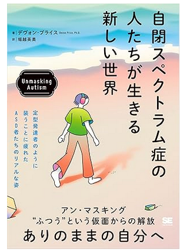
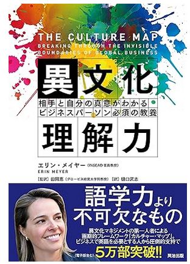

# MASD(Middle ASD)向けサバイバルガイド
[日本語](index.md) | [English](index_EN.md) | [GitHub](https://github.com/stakiran/middle-asd-survival-guide)

# (目次)
<!-- toc -->
- [MASD(Middle ASD)向けサバイバルガイド](#masdmiddle-asd向けサバイバルガイド)
- [(目次)](#目次)
- [はじめに](#はじめに)
    - [背景](#背景)
    - [用語定義](#用語定義)
    - [対象読者](#対象読者)
    - [注意事項](#注意事項)
- [MASD の定義](#masd-の定義)
    - [MASD](#masd)
    - [MASD かどうかを判定する](#masd-かどうかを判定する)
- [特性と方針を理解する](#特性と方針を理解する)
    - [ASD の特性](#asd-の特性)
    - [MASD の特性、に入る前に](#masd-の特性に入る前に)
    - [MASD の特性](#masd-の特性)
    - [MASD の立ち回り（方針）](#masd-の立ち回り方針)
- [法と制度について知る](#法と制度について知る)
    - [法律](#法律)
    - [会社の制度](#会社の制度)
    - [社外の制度](#社外の制度)
    - [戦略](#戦略)
    - [(余談) 筆者の実体験](#余談-筆者の実体験)
    - [(余談) 理不尽なわがままとはどれくらい？](#余談-理不尽なわがままとはどれくらい)
- [診断書について知る](#診断書について知る)
    - [診断のバリエーション](#診断のバリエーション)
    - [診断方法](#診断方法)
    - [診断書の効力とメンテナンス](#診断書の効力とメンテナンス)
- [自分の傾向を知る](#自分の傾向を知る)
    - [詳しめの書籍を読む](#詳しめの書籍を読む)
    - [論文は読まなくていい](#論文は読まなくていい)
    - [社会的な経験を積む](#社会的な経験を積む)
    - [振り返りをする](#振り返りをする)
    - [余裕と健康を恒常的に確保する](#余裕と健康を恒常的に確保する)
- [個別的配慮を勝ち取る](#個別的配慮を勝ち取る)

# はじめに

## 背景
2026 年 1 月現在でも、ニューロダイバシティの啓蒙はイマイチです。特に苦しいのが ASD のうち、性能が高くもなく低くもない層でしょう。性能の高さで補うこともできませんし、性能が低すぎるわけでもないので障害者向けの水準と生活で満足することもできません。しかし、マジョリティである定型発達らの集団と規範に適応するのは不可能か、困難か、あるいはできたとしても著しく消耗します。

ニューロダイバーシティには以下三つのアプローチがすべて必要と考えます。

- 1: マジョリティ側、特にマネジメントやリードを行う者がニューロダイバージェントを **上手く使う** こと
- 2: 同上、1: を行うだけのメリットがニューロダイバージェントにあることを示すこと
- 3: ニューロダイバージェント自身が、自身の特性およびニューロダイバシティの現状について理解し、先手を打って立ち回ることで自己防衛すること

本書では 3: を取り扱います。1: と 2: については[拙作](https://github.com/stakiran/asdm_public)をご覧ください（日本語のみ）

## 用語定義
- **定型発達（ニューロティピカル）**
    - ニューロダイバージェントでない者を指します
    - 通常はどの文脈においても圧倒的なマジョリティです
- **ニューロダイバージェント**
    - ASD、ADHD、LD など発達障害者を指します
    - 障害ではなく特性（脳の性質）が違うと考え、多様性の一つとして捉え直した言葉です
- **ニューロダイバーシティ**
    - 多様性の概念を、発達障害者に対しても適用したものです
- **合理的配慮**
    - 細かい定義は国により異なりますが、障害者に対して個別に特殊な配慮を行うことを指します
    - 障害者の言いなりになるという意味ではなく、双方すり合わせるニュアンスがあります
    - **ニューロダイバージェントにも適用できますが、概念として古いため本書では使いません**
- **個別的配慮（Individualized Accomodation）**
    - 合理的配慮の代わりに、筆者が提唱する概念です
    - 合理的配慮は **規範ドリブン** であり、まず規範に従うことを前提とした上で、障害者向けの個別の配慮を消極的に検討します
    - 一方、個別的配慮とは **例外ドリブン** であり、まず対象者を最初から特別扱いにすると捉える上で、規範にどれだけ沿うか、どのように沿うかを積極的に検討します

## 対象読者
**性能が高くも低くもない ASD 自身**。

定義は後で述べますが、このような ASD を MASD（Middle ASD）と呼ぶことにします。本書は MASD の、MASD による、MASD のためのサバイバルガイドです。MASD が、この不十分な社会――特に **会社員として生きていく** ためのヒントを提示します。

より具体的には、以下が当てはまるほど有意義な可能性が高いでしょう:

- MASD である
- ホワイトワーカーやデスクワーカーである
- 会社員である
- 日本に住んでおり、日本語で生活している

しかし、これらに当てはまらない読者にとっても有意義になると信じています。特定の文化、業界、組織に立ち入ることはせず、万人が参考にできるよう、本書はできるだけ汎用的かつ簡潔に整理されています。

## 注意事項
- 本書は筆者個人の見解であり、組織の見解ではありません
- 本書の運用により生じた、いかなる損害についても、筆者は一切の責任を負いません

# MASD の定義

## MASD
**MASD（Middle ASD）** とは、性能が高くも低くもない ASD を指します。

## MASD かどうかを判定する
まず以下の判定 1 は必ずクリアせねばなりません。クリアしない者は MASD ではありません。

- 1: ASD の診断書を持っている

診断書を持っていない人は、まずは入手してください。自己診断でも構いませんが、本書は診断書を持つ ASD が、それを開示した上での立ち回りを前提としています。診断については[診断方法を知る](#診断方法を知る)の章でも扱っています。

次に、以下判定項目に当てはまるものが多いほど MASD と言えます。本来なら「性能」を厳密に定義するべきですが、困難でしたので、このように判定項目を容易しました。MASD であれば全部か、少なくとも過半数は当てはまるはずです。当てはまらない場合、あなたは MASD ではないか、MASD かどうか判断できるだけの人生を過ごしていません。

- 1: 成人である
- 2: IQ が 86 以上、114 以下である
- 3: 入社して 5 年以上経過しているのに、一度も昇進したことがない
- 4: 以下をすべて満たす
    - パートナーがいない時期が 10 年以上ある。または容易に達成できそうである
    - 二人きりで数時間以上、無目的に過ごす機会を 2 回以上おくれる友達が 10 年以上いない。または容易に達成できそうである
- 5: 受験やオンラインゲームなど全国的に万人以上存在する実践者と競う世界において、「本格的な取り組み」をしているのに偏差値 50 を超えられない。あるいは稼働初期は超えられるが、3 年以内に実践者のレベルが上がってしまい 50 を下回るようになる
    - ※本格的な取り組みとは: 月30時間以上を費やすこと、勉強をすること、それのために生活の改善を継続的に行うことの三点がすべて当てはまること。当てはまらない月があっても良いが、当てはまる月の方が多い

# 特性と方針を理解する
自分の特性について理解してください。理解できていれば対処もしやすいです。

## ASD の特性
**運動神経ならぬ認知神経に障害がある**、と考えてください。

運動神経は運動能力を司る根幹です。ここに障害があると、マジョリティが問題なく行える運動――数十段以上の階段を行き来する、30 分以上継続して歩く、自転車に乗る、自動車を運転する、球技で遊ぶといったことすら行えません。努力しても行えないか、行うことはできるが人一倍の努力量を要します。

ASD は、一言で言えばその認知能力バージョンです。本書では **比喩的に認知神経と呼んでいます**。ASD は認知能力を司る根幹に障害があると考えます。ASD はマジョリティが問題なく行える認知的な発揮――たとえば以下のようなことができません:

- 非言語的かつ口頭ベースのコミュニケーションを 30 分以上処理する
- 様々な音が入り乱れる中で目の前の相手の発話だけ聞き取る
- 無理にルーティンやマイルールをつくらずその場の状況に素早く適応する
- 1日3食を食べず2000kcalも摂取していないのに仕事も趣味も人付き合いもこなす
- 複数の仕事を同時に進行できる（マルチタスクができる）
- 仕事で昇進するほど成果を出し、プライベートでも家庭を持ち、遊びに行ける友達もいるという三つの営みを入手し維持する

これらは努力、経験、知識の不足ではなく **性能の不足** によるものです。そしてその性能は認知神経から来ており、神経は鍛えることができません。どうしようもありません。一方で社会は **定型発達の認知神経水準が前提となっており**、ASD にも当たり前のように要求してきます。どうしようもないのに。

## MASD の特性、に入る前に
MASD の話に入る前に、その上下の話をしましょう。

ASD のうち、性能が高い者（HASD, High ASD）は特に困りはしません。あるいは容易に打開できます。たとえば IQ が高い ASD は定型発達以上に定型発達的な振る舞いを模倣できます。頭の処理能力でゴリ押しできてしまうのです。実際に HASD は MASD の定義にあてはまらず、平然と昇進していたりパートナーがいたり、燃費も良くて四六時中読書や趣味に没頭できたりします。

運動でたとえるなら、仮に片脚が無かったとしても、残る脚で 10 メートルのジャンプを 100 回、2 メートルのジャンプを 1000 回、50 cm のジャンプを 10000 回行える体力があったのなら生活などどうとでもカバーできるわけです。あるいはお金でたとえるなら、障害はあるが 10 億円を持っているようなものです。**性能があれば正直言ってどうとでもなる** わけです。

逆に ASD のうち性能が低い者（LAST, Low ASD）は、自律的に生活することすら困難でしょう。たとえば IQ が 80 以下の ASD が一人暮らしをしつつ、正社員として勤め続けるのは難しいと思います。このレベルの者は通常、両親の庇護下のもと、診断書のみならず障害者手帳も取得した上で庇護的に生きます。

両親側の経済力や忍耐力次第ですが、日本では比較的制度も整っており、このような暮らしであれば問題なく過ごせます。**だからといって MASD も同じように過ごせるかというと、いいえです**。MASD は LASD よりは性能が高く、つまりは高い水準にいます。

さて、ある水準にいる状態で、より低い水準が強要されることは（仕事の文脈では）ハラスメントと呼べるほど暴力的な行為です。絶対に許してはいけません。スマホや乗り物を使っている現代人に一切使うな、と言えるでしょうか。暴力的です。ゆえに MASD に LASD の生き方を薦めること自体が暴力的なことなのです。

## MASD の特性
上記を踏まえた上で、MASD の特性に入りましょう。

次の二点です:

- HASD のように性能でカバーできません
- LASD のような低水準で生きるわけにもいきません（そもそも許してはいけません）

これらは信念や戦略ではなく、特性であると理解してください。MASD は HASD のようにはなれませんし、LASD のように水準を下げるのも違います。あなたの周囲のマジョリティは、おそらく LASD 側を勧めてくるでしょうが、決して相手にしてはなりません。

MASD は HASD でもないし LASD でもない。ゆえにどちらの生き方もできない。

と、そう捉えるべきです。実際そうなのですから。ニューロダイバシティはまだまだ不十分であり、日本ではダイバシティの取り組みで表彰されるほどの大企業ですら、この程度も理解していません。それが現実です。厳しい現実です。

ゆえに、あなた自身が毅然と立ち回るしかないのです。そのための基礎が、**MASD は特性であってどうにかできるものではないのだ** と割り切ることです。

## MASD の立ち回り（方針）
ASD の特性は認知神経障害であり、MASD の特性は「HASD でも LASD でもない」でした。これらを踏まえた上で、では MASD はどう立ち回ればいいでしょうか。

方針は明確で、**定型発達向けの水準への適応をできるだけ回避すること** です。

用語を一つ導入しますが、定型発達向けの水準を **ティピカル・レベル** と呼ぶことにします。厳密な定義はしません。主観的に捉えて良いです。

例は挙げましょう。たとえば毎日同僚と一緒に食べること、月に 2-3 回存在する業務時間後の飲み会やイベントに参加すること、毎日 3 時間以上を会議や雑談に充てることなどはすべてティピカルレベルになるでしょう。これらは定型発達の認知神経があるからこそできることであって、ASD にできることではありません。あるいは、できても極めて高負荷です。

しかし、定型発達にとってティピカル・レベルは「当たり前にこなせるもの」です。また、円滑な組織運営のための営みでもあるので「とりあえず従うべきもの」でもあります。なので「こなせないことはありえない」とみなします。ですので、MASD 自身が回避しなければなりません。

回避にも色々あります。というより、あらゆる行動が対象です。事前に備えたり、近づかないようにしたり、速やかに距離を取ったり、もちろん主張したり衝突したりといったこともします。残念なことに、どれも **よくあります**。よくあるのです。

別の言い方をしましょう。**MASD は戦わなければなりません**。

ティピカル・レベルを言語化し、なぜそれができないかも言語化して、必要なら ASD であることもカミングアウトした上で、粘り強く主張して戦わねばなりません。もちろん、戦わずに済ませられるならそれでもいいですが、仕事の文脈だとおそらく難しいでしょう。**仕事は本質的にコミュニケーションが密になりやすい営みであり、したがって MASD の欠陥は露呈します**。

戦えば個別的配慮を勝ち取れる可能性がありますが、**戦わなければ死にます**。ティピカル・レベルという無理難題を突きつけられる構図なので、勝ち目はありません。短期的か、少なくとも中長期的に死にます。解雇されるでしょうし、その前段階で精神的に疲弊するでしょう。うつ病など二次障害に至ることもあります。ひどい場合はイジメなど暴力的な被害を被ることもあります。

大げさに聞こえるでしょうか。そうではありません。MASD の皆さんなら、現実はそんなに甘くないことはすでに理解しているかと思います。歴史的には一部の人種や性別のマイノリティ達が戦ってきましたし、今も戦っていますが、構図としてはこれと同じです。MASD は圧倒的に劣勢で、差別される側のマイノリティなのです。だからこそ、戦わねばなりません。

無論、戦ったから勝つというわけでもなく、基本的には難しい戦いなので、戦い方はよく考える必要があります。通常は真っ向から戦うよりも逃げた方が被害が少なくて済みます。真っ向から戦うのは、たとえば次のようなクリティカルな状況のときです――個別的配慮が不足しているせいでパフォーマンスを出せていないだけなのに解雇されそうである。明らかに評価が不当であり給与にも反映されず生活に響く。持続的に働けないレベルの負荷を強調されている。イジメやハラスメントを受けている。

この理不尽な社会を、一気に生き抜いていきましょう。本ガイドはそのための武器――知識と勇気を授けます。

# 法と制度について知る
法や制度を知っておくと、戦う上で有利になります。

## 法律
日本の話をします。他国の方は各自調べてください。

キーワードは二つあります。

一つ目は合理的配慮であり、企業には合理的配慮を行う義務があります。発達障害も対象です。

二つ目はオープン就労とクローズ就労です。オープン就労とは障害があることを会社に正式に届け出た上で、一般枠ではなく障害者枠で働く形態を指します。障害者枠だけあって配慮は大きいですが、仕事は単調ですし給料も低いです。

参考:

- 合理的配慮について
    - [合理的配慮指針.pdf](https://www.mhlw.go.jp/file/06-Seisakujouhou-11600000-Shokugyouanteikyoku/0000082153.pdf)
    - [雇用分野における障害者への差別禁止・合理的配慮｜厚生労働省](https://www.mhlw.go.jp/stf/seisakunitsuite/bunya/koyou_roudou/koyou/shougaishakoyou/shougaisha_h25/index.html)
- 2024年から合理的配慮の提供が義務化
    - [リーフレット「令和６年４月１日から合理的配慮の提供が義務化されました」 - 内閣府](https://www8.cao.go.jp/shougai/suishin/sabekai_leaflet-r05.html)
    - [事業者による障害のある人への「合理的配慮の提供」が義務化 - 政府広報オンライン](https://www.gov-online.go.jp/article/202402/entry-5611.html)

残念なことに、現代の合理的配慮はオープン就労とセットで行われることが多いです。すでに述べたとおり、MASD は LASD ではないので **オープン就労に就くべきではありません**。定型発達と同様、一般枠で働く（クローズ就労）前提で、その上で合理的配慮を要求してください。

なお、本書では個別的配慮という言い方をしていますが、この造語は通じないので、主張時は「合理的配慮」を使った方がいいでしょう。

## 会社の制度
会社の制度として確認しておきたいのは **通報の窓口と方法** です。

ポイントは次の二点です:

- 1: 上司や所属部門以外の、相談窓口を押さえておく
- 2: 内部通報の窓口と通報方法を押さえておく

個別的配慮を勝ち取るには、より強い圧力が必要です。まずは 1: のとおり、自分の所属部門以外の窓口を調べて、押さえてください。たとえば人事部や労働組合や I&D 部門などがありえます。規模の小さな会社だとないかもしれませんが、従業員 1000 人以上の大企業になると、おそらくあるはずです。全部門や全社員を調べられるシステムや情報をくまなく見て調べてください。

しかし、1: は会社側の人間であり、アテにならないことも多いです。そこで使いたいのが **内部通報** です。内部通報とは会社が設置した通報窓口に通報を行うというもので、主用途やハラスメントや不正会計の通報ですが、人権侵害も可能です。つまり人権侵害の一種として「合理的配慮不足」を通報します。無論、内部通報も会社が用意したものであり、1: と同様、アテにならない可能性もありますが、近年では社外機関に委託しているものもあり、まだ機能している可能性が高いです。

通報の際は、詳細な状況の提出が（テキストで）求められますので、日頃から記録しておきましょう。通報に添付するログの書き方は ChatGPT にも頼れます。時系列的に、誰が何をしてどうなったかを記録するだけです。感情や日記は抜きにして、事実を淡々と書きます。特に、いつ合理的配慮としてこれこれの提案を誰々にしたが、誰々は対応しなかった、のような「配慮不足のイベント」を貯めるといいでしょう。

## 社外の制度
私も使ったことはありませんが、以下があります:

- [紛争解決援助制度のご案内.pdf](https://jsite.mhlw.go.jp/kumamoto-roudoukyoku/content/contents/000976326.pdf)
- [個別労働紛争解決制度（労働相談、助言・指導、あっせん） ｜厚生労働省](https://www.mhlw.go.jp/general/seido/chihou/kaiketu/index.html?utm_source=chatgpt.com)

都道府県労働局による助言と指導に頼るというものです。ただし対象範囲は厳しめであり、

> 解雇、雇止め、労働条件の不利益変更などの労働条件に関する紛争
> 
> いじめ・嫌がらせなどの職場環境に関する紛争
> 
> 募集・採用に関する紛争（※助言・指導の対象にはなりますが、あっせんの対象にはなりません。）

と書かれています。解雇やハラスメントなどクリティカルな場合に、使えるかもしれません。

もう一つ、最終手段として裁判もあります。こちらも私は未経験なのでこれ以上は割愛します。

## 戦略
つまり法や制度を知った上での、戦い方は以下 3 ステップとなります:

- 1: 合理的配慮を主張して、個別的配慮を勝ち取る
- 2: 勝ち取れないなら社内の窓口、特に内部通報を使う
- （2.5: 個人的には一度社内外への転職をちゃんとやってみることを勧めます）
- 3: それでもダメなら「あっせん」や裁判など、社外の、より過激な制度に頼る

先に進むほど騒ぎが大きくなります。たとえば 2: を使うと、会社からは正式に目をつけられるでしょう。特にクローズ就労の場合、単に会社として「問題のあるローパフォーマー」にしか見えないため解雇候補になりやすいです。

これを食い止めるために **「私はニューロダイバージェントであり合理的配慮を受けねばならない」「実際には受けていない」とのストーリーが必要** なのです。すでに述べたとおり、国レベルで義務化されていますから、こちらがよほど理不尽なわがままを言っていない限りは、こちらが有利です。

## (余談) 筆者の実体験
日本では解雇には厳しい規制がありますが、それでも不可能ではありません。私も実体験として PIP（パフォーマンス改善プラン）を食らいました。

MASD としてコミュニケーションや働き方にハンデはありつつも、技術的には人並以上に優秀な部分があるにもかかわらず、です。元々私は同期の中でも技術力は頭一つ飛び抜けていましたし、今まで怠ったこともありませんし、実際今でも周囲よりは明らかに秀でています。無論業務経験の差はありますが、基礎素養とポテンシャルで言えば、正直言ってそこらの社員など比較にはなりません。この点は私の GitHub アカウントを見ても片鱗をうかがえるでしょう。私がローパフォーマーなのは、単に合理的配慮ゆえに仕事がなくて、仕事がないからパフォーマンスを出せていないだけです。なのに PIP に選ばれてしまったのです。

会社や上司からは「他にも対象者はいる」「成果主義への移行に伴う自然な流れである」「解雇の意図はなく健全な制度である」といった説明を受けましたが、私が周囲の「同じくローパフォーマーと評された者」にヒアリングしてみたところ、PIP を受けたのは私だけでした。また制度としても、最終的に適用するかどうかは上司や上位上司など判断者ら次第となっていました。つまり、穿った見方をすれば、イジメとして、あるいは人柱として私を選んだのでしょう。ちなみに、れっきとした会社制度であるはずなのに、なぜか箝口令を敷かれたりもして、私は不審感を強めていました。

これは人権侵害、合理的配慮不足であると考え、内部通報を行いました。その甲斐あってか、PIP は途中で撤回してもらっています。

ちなみに、通報後の動きは遅いので、1～2週間経っても動きがなければ催促してください。内部通報に限らず、社内窓口への問い合わせ時も同様ですが、基本的に遅いか、スルーされがちなので、**催促はよく使う** ものと考えてください。

## (余談) 理不尽なわがままとはどれくらい？
戦略の節にて、

> こちらがよほど理不尽なわがままを言っていない限りは、こちらが有利です。

と書きました。では、理不尽なわがままとはどの程度のものでしょう？

無論、この場で定義できるものではなく、会社と状況次第ですが、個人的な所感がいくつかあります:

- 1: 対話に応じないこと
- 2: 具体的な提案ができないこと

まずは対話に応じないことです。発達障害者が裁判に負けた事例はいくつかあるのですが、共通する点は「発達障害者の社員側が対話に応じていない」ことです。対話のための打ち合わせに参加しないとか、メッセージのやりとりをスルーする・拒否するなどです。

日本でも合理的配慮は「継続的対話によるすり合わせ」と説明されることが多いようですし、裁判でも焦点があたるほどの重要な概念だと捉えられます。ですので対話に応じないスタンスはいけません。

それから具体的な提案ができないことです。たとえば MASD は会社が遠い場合、毎日出社や出社メインの働き方自体が苦しくて、リモートを要求することになるでしょう。このとき、どうやってリモートで働くのかを具体的に提示できねばなりません。Teams や Slack でテキストコミュニケーションをする、打ち合わせはリモートで定期的に行う、Notion や Google ドキュメントや Microsoft Loop など同時編集可能なノートを使うなど、やりかたは無数にあります。この提案がないと「机上の空論」扱いされてしまって不利です。**相手がこちらの具体的な提案を理解し、実践できる力やモチベがあるかどうかは別として**、少なくともこちらとしては具体的な提案をできた方が良いです。

上記二点を、日頃のやりとりを記録しつつ押さえておけば、戦いに負けることはないと思います。

ちなみに「仕事がない」「案件やチームとのマッチングが上手くいかない」はあるあるですが、これは上司側などの問題であって、あなたの問題ではないため気にしなくてもいいです。ただし、対話に応じやすくするため、あなたからできること、できないことを提案したり、（おそらく仕事がなくて時間もあるでしょうから）自ら社内を調べ回って仕事にできそうな機会を探して上司に提案したりしましょう。このように **意欲を見せる** ことでも、理不尽なわがままから遠ざかることができます。

# 診断書について知る
対象読者の節で述べたとおり、MASD であればすでに診断書を入手しているはずです。

本章では診断書の取り扱い――特に再検査の要否を判断するための情報を整理します。結論を言うと、再検査はしなくて良いと考えます。またついでに障害者手帳についても取り上げますが、MASD には関係がないことなので深堀りはしません。

## 診断のバリエーション
結論から述べると、診断書の有無と手帳の有無で 4 パターンあります。

|                  | 診断書がある | 診断書がない |
| ---------------- | ------------ | ------------ | 
| 障害者手帳がある | LASD | - |
| 障害者手帳がない | MASD | 定型発達 |

MASD は「診断書は持っているが手帳はない」パターンになります。その気になれば手帳の取得は可能だと思いますが、MASD でありながら手帳を持つ水準に落とすのは苦しいと思いますし、あってはならないとさえ考えます。何度も述べたように、MASD は LASD ではないからです。

## 診断方法
診断書の入手は、対応した病院で検査を受けることから始まります。検査は心理士が行い、「発達障害の疑いが高い」のような判断をします。この時点ではまだ診断は下りません。診断は、その結果を受けて、医師が行います。発達障害であると診断して、初めて診断書も発行します。

障害者手帳については、行政に申請する形で発行可能です。ただし発達障害を直接扱ったものはなく、精神障害者保健福祉手帳つまりは精神障害のカテゴリーで申請することになります。また診断書が必須ですし、二年ごとの更新も必要です。MASD とは関係ないのでこれ以上は扱いません。

## 診断書の効力とメンテナンス
ASD 自体の検査については、**一度診断を受けただけで十分** です。

現時点では治るものではないですし、検査についても専門的かつ入念であって、狙って取れるものでもありません。ASD と診断されたら、もう ASD なのです。現時点では覆ることはありません。ですので **「もう一度診断して最新の結果を取得してください」のような助言や命令に従う必要はありません**。むしろ、このようなことを言ってくる相手は、ニューロダイバシティに対して無知だと考えていいでしょう。警戒してください。

もう一つ、診断書の詳細を更新するという考え方があります。検査は繰り返さず（つまり ASD であるとの結果はそのまま）に、詳細の内容――具体的には就労に関する配慮内容を更新するのです。これは医師との診察を繰り返すことで行います。会社はこの詳細の更新を要求してくるケースが多いと考えます。

この更新をやるかどうかは好きにしてください。

- 更新する場合:
    - ⭕診断書に配慮内容が書かれるので、有無を言わさず（記載された分の）配慮を勝ち取りやすい
    - ❌何度も病院に通う必要がある
    - ❌あまり具体的な配慮内容は書かれない（というより個人差が大きいので書けない）
- 更新しない場合:
    - ⭕更新する場合の徒労がない
    - ❌会社が合理的配慮を渋る（配慮内容が診断書に書いてないと無効だと主張する無知な人間が多いです）

考えるポイントは二つあると思います。一つは、更新する場合の徒労を許容できるかどうかです。もう一つは、あまり具体的ではない配慮内容の記載を狙うかどうかです。たとえば私の場合、「フルリモート、フレックス制、残業なし」くらいは書いてもらえましたが、これより具体的な配慮事項は書いてもらえませんでした。医師としても、医学的に言える部分までしか書けないので、結局このくらいの抽象度でしか書けません。たとえば、以下くらいの具体的な内容は書けません:

- パフォーマンスを維持するために朝型の生活リズムをおくらねばならない
- 就業は 6:00～16:00 の範囲内でなくてはならない
- 議は 1 日 2 時間以内かつ 2 回以内に抑えなければならない
- Excel を用いた計画と管理を要するような仕事に従事させてはならない

私は **更新しなくていい** と考えます。というのも、合理的配慮を行わないような人や会社は、あまり具体的ではない配慮内容があったところで従いませんし、難癖を付けて再検査を勧めてくるだけです。逆に、合理的配慮をしてくれる相手であれば、配慮内容がなくとも、ASD の診断というだけで応じてくれるはずです。

# 自分の傾向を知る
ASD はその名のとおりスペクトラムであり、誰一人として同じパターンはありません。ASD が 1000 人いたら、1000 通りのパターンがあるのです。

無論、**自身がどんなパターンであって、どのように配慮すればいいかなんて誰も教えてくれません**。医師やカウンセラーや友人に頼っても難しいでしょうし、そもそも MASD であればそのような友人はつくれないと思います。結局、あなた自身が知る必要があります。その上で「私はこのような性質を持っているので、このように配慮してください」とお願いしなければなりません。

自分について知りましょう。自分という ASD は一体どういう性質を持っているのか。また何をどうやれば調整できるのか。できれば人並以上の強みも知りたいところです――本章ではそのためのヒントをお届けします。

## 詳しめの書籍を読む
すでに ASD を題材とした書籍は多数あり、中には ASD のメカニズムや頻出パターンに焦点を当てたものもあります。

たとえば私が最近読んだ『自閉スペクトラム症（ASD）社員だからうまくいく——才能をいかすためのマネージメントガイド』は、300 ページ超の分厚い本ですが、良かったです。まずはこれを読めと勧めたいくらいに。

もう一つ、『自閉スペクトラム症の人たちが生きる新しい世界 Unmasking Autism』も読み始めていますが、この本も良さそうです。

この本は ASD が日頃被っている仮面を脱ごうと説いていますが、その前段階、特に第一章までで ASD 自体の性質を詳しく述べています。

本を選ぶ際は、ASD 自体の解説に深く踏み込んでいるかどうかを見てください。エッセイや評論は（面白いかもしれませんが）役に立ちません。端的な目安は **書名に「ASD」や「自閉症スペクトラム症」を含むかどうか** だと思います。この比較的専門的なキーワードをわざわざ使っていること自体が、専門性に踏み込んでいることの表れです。

逆に「発達障害」だと内容が浅くて、参考にならないかもしれません。また「自閉症スペクトラム症」ではなく「自閉症」や「アスペルガー」の場合も、おそらく役に立たないでしょう。HASD や LASD を扱っている可能性が高いからです。

なお、書籍の意図は無視していいです。たとえば上記は「マネージメントガイド」とあり、ASD の部下を抱えるマネージャー向けの書籍だと読めますが、別にマネージャーでなくても読んでいいです。あるいは「ASD が見る世界」だからといって、そのような世界に興味を持つ必要もないですし、「ASD の成功者」だからといって成功者に興味と敬意を持つ必要もない。

## 論文は読まなくていい
ASD について知るために「論文」を読めばいいのではないか、と思われる人もいるでしょう。読めるなら読んでもいいですし、書籍よりも情報が広くて深いのも事実ですが、MASD には難しいと思います。

よく論文を読み漁る ASD を見かけますが、そういう人は HASD だと思います。読み漁れるだけの好奇心、体力、知力が備わっているわけで、それだけ強いなら別に苦労はしないのです。

私が「読まなくてもいい」と考えるもう一つの理由は、論文だと他者に通じないことです。書籍であれば「これを読んでください」とお勧めできますし、それで読もうとしない相手（特に上司など仕事で直接関わる者）には配慮の能力がないと判断できますが、論文を読ませるのはさすがに酷です。一方で、あなたがアカデミックな世界にいるのなら、逆に論文の方が読んでもらえるかもしれません。個人的には MASD がアカデミックにいる可能性は低いとは思いますが。なぜなら、それだけの頭脳があるなら、おそらく HASD だろうからです。

## 社会的な経験を積む
情報をインプットした時点では「知識」にすぎず、まだ自身には根付いていません。本当に自身に当てはまるか（自身の傾向なのか）どうかを知るには、実際に経験してみる必要があります。定型発達や HASD であれば想像力でカバーできますが、MASD にそれだけの力はありません。とりあえず経験してみないことには始まりません。

たとえば CPPF（子供、パートナー、ペット、友達）を持つという営みが好きかどうか、あるいは向いているかどうかが知りたいなら、実際にそのような経験を積みに行ってください。子供と接する機会はボランティアを探せばあります。パートナーについては、マッチングサイトや婚活など出会い系をしてみるか、今現在の人間関係の中でめぼしい人にアタックしてみましょう。ペットについては、YouTube でペットを飼う人の動画を見たり、ペットショップに行ってみたり、動物園や猫カフェなど動物を鑑賞できる施設に行ってみたりします。友達については、ランチや飲み会、または趣味の集まりなどに参加してみればいいでしょう。

見ておきたい観点はいくつかあります:

- 興味
    - 好きかどうか
    - もっと言えば「誰に何を言われずとも続けたい」かどうかです
- 成長性
    - 継続的に成長できるかどうか
    - 要領があるか、環境に恵まれている場合、阻害や排斥を受けることなく成長していけます。友達とのお出かけが 2 回以上続いたり、恋人関係に至れたりすることもありえます
    - 逆に要領がないか、環境がシビアな場合、そうなる前に阻害されたり、ひどいと排除されます
- 献身性
    - 継続的に投資できるかどうか
    - このような営みは重要だから興味や好き嫌いや適性にかかわらず続けよう、と思えるかどうか。また実際に続けるための行動を粘り強く模索しているかどうか
    - 逆に、そうだと思えない場合は行動をやめたりします

社会的な経験と言っても色々あります。いくつか例を挙げます:

- CPPF の入手
- CPPF の維持
    - わかりづらいですが「入手かつ維持もする」「入手はするが維持はしない」「新たな入手はしないが維持はする」「入手もしないし維持もしない」があり、入手と維持は別物です
- フルタイムで同僚と働くこと
- 仕事で顧客と接すること
    - サービス業が有名ですが、本書の想定読者層であるデスクワーカーであっても「顧客のように丁寧に接するべき人物」は珍しくありません
- ファストフードなど高度にシステム化された店員とのやり取り
- 個人商店など地元に根づいた、人間味の強い店員とのやり取り
- 赤の他人に道を尋ねる
- 赤の他人をナンパする
- 開催日時の定められた対話型のイベントに参加する
- 開催日時の定められた体験型のイベントに参加する

つまり **様々な「社会的な経験」に対して、興味・成長性・献身性の程度を調べたい** のです。

定型発達や HASD の場合はどれも難なくクリアできるか、やろうと思えばクリアできるようになれるものですが、MASD はそうではありません。できる・できない、やりたい・やりたくないがはっきりと分かれます。すでに述べたとおり、ASD は認知能力にハンデがあるわけですし、MASD は HASD のように性能でカバーもできません。そんな状態で、あらゆる社会的な経験を相手にしていてはパンクしてしまいます。

だからこそ、どこが向いているのか、どこが向いてないのか、あるいは向いてないけどやろうと思えば何とかできるのか、それとも向いてないしやろうとしてもできないのか――そういった傾向を、事細かに知る必要があるのです。知れば対処と対策もやりようがあります。逆に、知ることができなければ、ただただギャンブルに身を投じる羽目になってしまいます。

## 振り返りをする
定型発達は慌ただしく生活をおくっているだけで自然と成長していきます。一度注意されたことを二度と犯さないよう気をつけることも可能です。特に仕事では、時間と成長は比例するものと考えられており、私たちは「社会人としての振る舞い」「入社 3 年目の水準」「30 代が身に付けているべき能力」といった基準を当てはめられます。

この非常に高度な営みは、分解すると次のようになっています。

- 1: 誰もが身につけるべき能力や振る舞いは、とにかく習得する
- 2: 得手不得手があってカバーし合えばいい部分については、得手を使う機会を増やし、不得手を使う機会を減らす

1: は本節では割愛するとして、2: の部分は「自分の傾向」を知っているからこそできることです。

では MASD も同じようにできるでしょうか。答えはいいえです。すでに述べたとおり、頭の中だけで 2: をしていけるだけの性能がないため、時間と成長は比例しません。私の例で言うと、接客のアルバイトをしていた頃は 3 年目にもかかわらず 3 ヶ月の新人から指導されていました。今も会社で 10 年以上勤めていますが、未だに平社員ですし、給料も新卒より低いですし、自分より年下の上司やマネージャーと接する機会も増えてきました。しかし、これでも MASD として善戦できている方です。平均的なアラフォーほど成長はしていませんが、代わりに自分の傾向を知り、強みを磨いてきました。たとえばこのようなドキュメントを書くくらいは造作もないことです。

前置きが長くなりましたが、**MASD は頭の中だけで自分の傾向を把握し、成長していくことが困難です**。それを行えるだけの性能がないからです。構造的な問題であり、努力でどうにかなるものではありません。

ではどうするかというと、頭の外で把握できるようにします。それが振り返りです。

**振り返りとは、ここでは以下の二点を両方行う営み** だと定義します。

- 1: 記録に基づいて過去をレビューすること
- 2: 未来のために、何らかの行動を仕込む

記憶ではなく記録に頼っているのがポイントです。また、次につなげるために、何らかの行動をしなければなりません。心がけるだけでは意味がないですから、実際に行動が起きるように **仕込みます**。たとえば机がガタガタ揺れるせいでパフォーマンスが落ちていて何とかしたいとわかったのなら、揺れを直したり机を買い替えたりするための行動を仕込みます。スケジューラーに予定を入れたり、普段使う買い物メモに書き足しておいたりします。ただ頭の中で心がけるだけではなくて、実際に何かを仕込むのです。

まるでタスク管理に執心するビジネスマンやライフハッカー、あるいは命令どおりに動くロボットのようなものですが、**そのイメージで合っています**。むしろ、意図的に人生をシステマチックにするつもりで仕組みをつくりあげた方が良いのです。

ここで登場するのが自己啓発、仕事術、ライフハックといった種々の概念やテクニックですが、本質は比較的単純です。自分なりに以下を整備すれば良い:

- 記録について
    - 1: やること、やったこと、考えたことや感じたことなどを毎日記録する（ **デイリーログ** ）
    - 2: デイリーログ 7 本をインプットにした振り返りを行い、週単位の記録もつくる（ウィークリーログ）
    - 3: ウィークリーログ 4-5 本をインプットにした振り返りを行い、月単位の記録もつくる（マンスリーログ）
- 行動について
    - 4: **動線（1日数回以上通る場所）** を意識し、次やりたいことは動線上に配置する
    - 5: 指定時刻前にアラームで教えてくれる **リマインダー** は必要に応じて使う
    - 6: 日々やることはデイリーログに記載し、ログと現実を行き来しながら一つずつやっていく（ **リスト駆動生活** ）

難しく聞こえるかもしれませんが、どれもテクニックとしては初歩的なものです。特にタスク管理やノートテイキングといったジャンルを調べてみてください。上記 6 点の内容を理解し、自分なりに実践してください。上手くいくようにカスタマイズしてください。

なお手段については、紙やペンや手帳などアナログに頼るやり方と、テキストファイルや SaaS などパソコン上のツールに頼るもの、また近年ではスマホアプリでも可能です。個人的には **デスク上で取り組むもの** をおすすめします。パソコンを使うか、アナログかのどちらかです。スマホはおすすめしません。作業領域が狭く、文字の入力もしづらいからです。慣れているなら構いませんが、MASD には厳しいと考えています。スマホは軽い用途には便利ですが、振り返りのような本格的な用途には不向きです。性能に乏しい MASD には厳しいはずです。しかし、MASD でもスマホで完結できる可能性はありますので、できるのであればそれでいいです。

私としてはデスク上でパソコンかアナログをおすすめします。もしデスクがないか、あってもひとりでじっくり取り組めない場合は、まずはその入手を目指してください。1日2時間、できれば3時間は「ひとりきりでデスクに座れる時間」がほしいです。厳しい要件かもしれませんが、MASD の宿命と考えてください。**誰にも邪魔されない、仕組み化された、自分の城** があって初めて、まともに生活や仕事ができるようになります。これがあるからこそ、自律的に生活を営めるようになります。

逆にここがないと、MASD は誰かに頼りっぱなしの生活になってしまいます。しかし MASD には人と対等に付き合えるだけの要領――もっと言うと、そのための性能がないので、そんな生活は上手くいきません。マスキングとも呼ばれますが、相手の機嫌を損ねないよう神経を使って過ごすか、あるいは一緒に過ごせる相手との出会いとマッチングをひたすら試行錯誤する羽目になります。どちらの場合も、やりすぎるとバーンアウトを始めとするダメージにつながりかねません。無茶な生活をしているのだから当然です。そんなクソみたいな生き方ができるのは定型発達か HASD だけです。

戦い方が間違っているのです。MASD は基本的に孤独に過ごさねばならない。それが現実です。孤独に過ごすためには、自分を律してくれる仕組みと、自分の成長と行動をサポートしてくれる仕組みが必要で、それが上述したデイリーログ、動線、リマインダー、リスト駆動生活なのです。また、仕組みを上手く使うために、聖域化したデスクがあった方が良いのです。

## 余裕と健康を恒常的に確保する
本章のここまでの内容を軽くおさらいしましょう――自分の傾向は誰も教えてくれませんし、自分で知るのにも多くの時間を必要とします。インプットもしますし、自分の行動も振り返らねばなりません。他者と比較すれば理解しやすいですが、そのためには具体的な人付き合いと協調が必要です。また、私達は MASD なので、適当に過ごすだけでこなせるわけではなく、自分なりの仕組みを構築して回す必要もあります。私達も人間ですが、しかしロボットのような生き方をしないと、まともに生きていけないのです。

さて、このような営みは疲れます。疲れた状態では何もできませんので、しっかりと休む必要もありますし、休める時間がないなら周囲と衝突するか周囲から逃げてでもつくらねばなりません。もちろん、人間ではあるので、孤立や孤独が過ぎると病んでしまいます。

そういうわけで、余裕と健康を **恒常的に** 確保しなければなりません。

私は「アスリートのようなもの」と表現しますが、MASD が自分の傾向を知りたいのなら、アスリートのように生活を厳しく律した方がいいでしょう。たとえば次のとおりです:

- 1: 1日7時間以上の睡眠時間
- 2: 1日3食きっちり食事を摂ること
- 3: 1日3時間は独りで過ごせて、かつ誰からも割り込まれない時間を確保すること
- 4: 1時間以上の「社交的な時間」に浸らないこと（1時間続く前に短時間の休憩を差し込むこと）
- 5: 健康診断でオール A が出る（ただし「痩せすぎ」は体質の可能性が高いため問題ない）程度の健康を維持すること
- 6: 階段 100 段や徒歩 30 分を苦なくこなせる程度の運動能力を維持すること

これらを満たさない人は非常に多いですが、それで生活が成立しているのは単にそれだけの性能があるからです。定型発達や HASD だからこそできる力技にすぎません。MASD は違います。力技を通せるだけの性能はありません。

上記はあくまでも MASD 万人に当てはまりそうな例にすぎません。あなた自身に合った条件は、ご自身で定義した方がいいでしょう。

たとえば私は 4: を定義しています。これは「一時間以上続けて社交的な時間を過ごすな」という原則です。MASD は人とコミュニケーションを取る際は相当無理をしているんで、ある程度続けると非常に消耗します。**MASD にとって他人とのコミュニケーション（特に対面で口頭で行う密度の高いもの）は瞬発的なもの** だと考えられます。持久的なものではない。ゆえにこまめに休憩を差し込むべきですし、一日何回も何回も行えることではない――と、このあたりの体感を反映した原則になります。

さて、原則を定義したら、もちろん日頃から守れるようストイックに生活していきます。様々なテクニックが必要ですので、書籍や動画や生成 AI を駆使して、自分なりにヒントを集めてください。そして実践していって、自分なりの型を確立してください。もし環境や責務のせいで達成できそうにないなら、その原因から逃げるか、その原因と戦ってください。

たとえば仕事は、おそらく毎日定時退社以下で済ませる必要がありますし、通勤時間も片道 1 時間以内、できればリモートを多くしたいです。これらを満たせない場合、満たせるように社外転職するか、社内転職するか、上司や同僚に主張して個別的配慮を勝ち取ってください。勝ち取れない場合、少なくとも中長期的には自らが破滅に向かいますから、最悪刺し違えるつもりで戦ってください。

このあたりの匙加減は非常に難しいです。次章で詳しく紹介しますが、良いテクニックがあれば私も知りたいくらいです。苛烈に戦うと勝率は上がりますが、排斥やイジメを受けるレベルの敗北もしやすくなります。逆におとなしく過ごしていると、過激な敗北には至りにくいですが、茹でガエルのようにじわじわと追い詰められていきがちです。

# 個別的配慮を勝ち取る
ここまでの章で「MASD の性質」「法と制度と診断書の話」「自分の傾向の知り方」を学びました。あとは、これらをフル活用して個別的配慮を勝ち取るだけです。

本章では具体的にどんな戦略を取ればいいかを整理します。いずれも私の経験と熟考がベースとなっており、万人向けではありません。素直に取り入れるも良し、反面教師とするのも良しです。

## 三要素のバランスをコントロールする
MASD の立ち回りとして、私は以下の三要素のバランスを掴むべきだと思います。

- 献身性
    - その仕事や環境に対して、自分の生活をどこまで差し出せるか
- スキル
    - 絶対的または周囲から見て相対的に選ばれる（アサインされる）ための、何らかの技能
- コミュニケーション・コントロール
    - 周囲の、自分に対するコミュニケーションの仕方を制御すること

### 各要素の解説
まず各要素を見ましょう。

**献身性** とは、その仕事や環境に対する献身の度合いです。MASD であれば、すでに自分の生活リズムや就業中の過ごし方は神経質に決まっているかと思います（無自覚な可能性もあります）。しかし、仕事とはコミュニケーションであり、コミュニケーションとは場に合わせることです。自分の過ごし方を優先できるとは限りません。それでも自分を貫くのか、それとも自分を曲げて場に合わせるかのどちらかに寄せることになりますが、後者に寄せることを **献身** と呼んでいます。

**スキル** とは、手に職をつけるといいますが、それなりの訓練をしないと身につかない何らかの技能を指します。私の例で言えばプログラミング、ライティング、リモートワーク、正解や管理のない探索を自律的に行える力、ブログやウェブサイトや GitHub を含むテキストの配信、暗黙知や文化の言語化と公開、創造的思考を用いたコラボレーション方法の設計とファシリテーションなどがあるでしょう。あるいはいくつかの資格も持っています。スキルがあると、絶対的な条件を満たすか、あるいは周囲から見て相対的に秀でているなどの理由で「選ばれやすく」なります。

**コミュニケーション・コントロール** とは、自分に対するコミュニケーションの仕方を制御することです。一言で言えば「どれだけ嫌われて距離を置いてもらう」か、あるいは「どれだけ腫れ物になるか」とも言えます。MASD は多くの会社やチームが想定する過ごし方――ティピカル・レベル前提の過ごし方にはまず追いつかないし、耐えられないので、**コミュニケーションの物量そのものを必ず人並未満にまで減らさねばなりません**。無論、器用に配慮を勝ち取れるなら苦労はしませんし、そんなことは不可能です。嫌われねばなりません。もちろん、嫌われすぎて排除されてもいけないので加減も要ります。

### LMH による自己評価
次に三要素各々をLow（できないかできないことが多い）、Middle（できるが消耗が著しく安定しないこともある）、High（できるし再現性が高い）で評価します。これであなたのタイプがわかります。

全 27 パターンを挙げるつもりはないですが、いくつか挙げましょう:

| 1.献身性 | 2.スキル | 3.コミュニケーション・コントロール | タイプ |
| --- | --- | --- |  --- | 
| H | L | L | 献身タイプ。生活に支障が出るほど疲れているはず…… |
| H | M | L | 献身タイプ。かつスキルがあるので重宝されやすく、定着しやすいかもしれません |
| H | H | - | N/A。MASD で両方 H を取るのは性能的に難しいと思います |
| H | M | M | N/A。MASD の性能で難しいと思います。献身性に High だとそれだけで疲弊しきるだろうからです |
| L | H | L | 職人タイプ。しかし献身もコントロールも低いので、排除・イジメ・解雇に遭う可能性が高そうです |
| L | H | H | 職人タイプ。最初から腫れ物として主張しており、定着はできますが、転職など「入るとき」が厳しいでしょう |

ちなみに私は L/M/H といったところです。

とにかく献身性が低いのでトラブルになりやすいし、献身すると自分が壊れることがわかっているので譲る気もありません。しかし、これだと仕事も見つからないし、今の居場所さえも危なくなるので、コミュニケーション・コントロールを駆使して、**最初から** 腫れ物であるとアピールします。10 年以上の社会人経験と社歴があるので、さすがにだいぶ掴んできました。必要に応じて ASD の診断書も提示します。加えて、何らかの仕事に貢献するために、スキルを鍛えることも意識しています。私は自分の強みにフォーカスしており、強みを何とか会社の、今の居場所に当てはめられないかを常に模索しています。

この性質上、私は平均的な社員よりも稼働とコミュニケーション量が低く、接点も少なくなります。末端の平社員ですが、自分から仕事を探して相談したり、許可を得た上で他部門に営業しにいくことが多いです。発信も得意なので、ブログやアドベントカレンダーといったテキスト投稿的な場所にも顔を出し、この件については社内でも有数の有名人となっています。実際、私の過去の異動を見ても「ブログで知っていたから気になって拾った」といった声が多いです。

と、これは一例ですが、自分のタイプに応じた戦略を取らねばなりません。向いてないタイプで勝負しても自滅するだけだからです。

まだわからないのであれば、とりあえず試してください。献身性を高くしてみたり、職場に刺さりそうなスキルを集中的に鍛えてみたり、コミュニケーション・コントロールとして「会議が週に 2 回以内になるように立ち回る」を目指してみたり、などやってみます。

### 各要素の鍛え方 > 献身性
最後に、各要素の鍛え方について取り上げておきましょう。長いので一つずつ解説します。

献身性については、「どれだけ我慢できるかを試せばいいのか」と思われがちですが、違います。もっと重要な観点があって、**自分の生活をできるだけコンパクトにすること** です。仮に日中の家事をすべて終えるのに 1 時間で済む場合と、3 時間もかかる場合、明らかに前者の方が生活の融通は利きやすいです。

もっと直接的に言えば **できるだけ暇でいれる時間をどれだけつくれるか次第** です。理想を言えば、1日4時間くらいは暇をつくりたいです。その暇は何をして過ごしてもいい。一度読んだマンガやゲームで遊ぶといった時間潰しでもいいのです。普段はそうして適当に過ごしておき、献身するべきタイミングが来たら、この暇を充てて対応するのです。

つまり **暇というリソースを消費して献身に対応する**、とのモデルになります。リソースの量が多ければ多いほど対応しやすいのです。そういうわけで、ライフハックやミニマリズムといった、生活をコンパクトにするテクニックが **非常に** 重要になります。MASD は性能が低いのですから、こういうテクニックはフル活用して、少しでも生活をコンパクトにせねばなりません。

MASD で上手く過ごせていない人は、十中八九この点が甘い印象です。たとえば前の章でも CPPF（子供、パートナー、ペット、友達）という言葉を出しましたが、**CPPF を一つも持たない、くらいは当たり前にできないといけません**。むしろ、この程度のコンパクトさも手に入れずに、MASD として真っ当に生きていけるわけがないだろ、とさえ私は思います。大前提として ASD は障害と呼ばれるほどの困難な呪いであり、MASD は HASD として性能でカバーもできません。だからこそ、少しでもスリムになって、少しでも動きやすく在らねばならないわけです。

厳しいですか。そのとおりです。MASD という呪いは、人種的なマイノリティや性的マイノリティに匹敵するか、それ以上のデバフなのです。よく ASD 当事者が楽観的に語っているのを見かけますが、あれらは単に HASD であって、性能でカバーできているだけですので鵜呑みにしてはいけません。実際、そのような人は MASD の定義を満たしていません。

私達 MASD は、この厳しい現実を受け入れた上で、自分を強くしていくしかないのです。少なくともニューロダイバシティが不十分な 2026 年現在では。

### 各要素の鍛え方 > スキル
スキルはハードスキルとソフトスキルに分かれます。

ハードスキルは、あると示せれば仕事につきやすくなるもので、資格か業務経験によって示せます。資格を得るには勉強と経済力が必要です。特に資格は利権化しやすく、受験や教材の入手などで万単位、下手するとそれ以上かかることもざらにあります。業務経験を得るには、もちろん会社で仕事として働かなければなりません。業務経験は証明できませんが、仕事のマッチングではほぼ必ず面接のような会話かテストが入り、そこで見抜かれます。

ソフトスキルは、ハードではなく、主に人間の扱いに絡む汎用的なスキルを指します。コミュニケーション、マネジメント（部下やメンバーの管理）、セルフマネジメント（自己管理）、リーダーシップ、創造的思考、フル出社を行える技能、フルリモートを行える技能など無数にあります。ハードスキルよりも示しづらく、暗黙のうちに要求されることが多いです。これをクリアできなくても仕事がマッチングすることはよくありますが、その先、実際に仕事をするときに地獄を見ます。自覚や言語化がされてないことも多いので、改善のしようがないこともよくあります。

たとえば「私は朝型であり夜型の勤務リズムは難しい」「6:00～15:00くらいのフレックスにしてほしい」という配慮のお願いは、働き方に無頓着な相手や組織には通じません。信じられないかもしれませんが、定型発達の中には、自分達の働き方が唯一であって変えることはできない、変える発想すら抱かないということはよくあります。というより、その融通の利かなさは定型発達の主要な特徴でもあります。定型発達は高度で瞬発的な情報処理が行えるかわりに、既存の規範に従うことに最適化されているので、既存のあり方を疑えないのです。もちろん個別的配慮も苦手です。だからこそ、MASD は戦わなければならないと本書でも口うるさく言っています。

話を戻しましょう。続いてスキルの鍛え方に言及します。

最も確実なのは、やはり仕事をすることです。仕事だと個人では到底手に届かないレベルの機会――機材、設備、人間を相手にできるので、単にひとりで鍛えるよりもはるかに効率的に鍛えられます。スキルが高い人は、基本的にその分仕事をしています。スキルの高さとは単に仕事をどれだけやってきたかにかかっています。ですので、組織やチームの一員として堂々と、持続的に働けるかどうかが一つの目安となります。

もっとわかりやすい目安があって **昇進** または **転職** です。昇進できた、あるいは転職して待遇が上がった場合、その仕事に関するハードスキルはそれなりに身についたと言えるでしょう。昇進も転職もできない場合は、まずはできるようになるだけの仕事を手に入れねばなりません。すでに大企業の正社員であれば、待ち時間（というより待ち期間）も長いし、社内転職や仕事のマッチングも無数にあるので何とかなりやすいですが、そうではないケースの方が多いでしょう。中小企業だと社内の流動性がほとんどないですし、派遣は派遣先は厳しくて仕事どころではない可能性が高い（定型発達でも上位 1～2 割しか上がれない世界です）。

そうなってくると、身も蓋もないですが、**そもそも仕事を持続しやすそうな職場を選べる力の有無が重要になってきます**。具体的には学歴を身につけて大企業に入るか、手に職をつけやすい資格を手に入れてその仕事をするかの二択です。結局、勉強が重要になってきます。私も学生時代は偶然ガリ勉になりました。全国模試の偏差値で言えば 50 も行かなかったのですが、校内では首席でした。偏差値の低い学校に入って、そこで誰よりもガリ勉になることで相対的に強いポジションを築いていました――といっても、本書の読者は成人であり、学生時代はすでに越えているはずなので、このやり方は使えません。現実的には資格を取るか、修士や博士といった学位を取るかの二択です。ただ MASD が社会人と大学院生を両立するのは不可能でしょう。それだけの能力があるなら、すでに仕事で成功して MASD の定義から抜けているはずだからです。MASD でも両立できる可能性があるとしたら、実家に余裕があって、かつ一時期的に無職になるくらいだと思います。

いずれにせよ、勉強がものをいいます。MASD はおそらく時間が多く、同じことを持続的に行うのも得意だと思うので、実は勉強との相性は良いです。それでも偏差値 60 以上や弁護士や医者の資格を取るといったことは一生できないでしょうが、ある程度なら十分可能です。たとえば 1 日 2 時間の勉強を 1 年続けるだけでも、それなりの資格が取れます。私の場合は IT エンジニアということもあって、基本情報処理と応用情報処理、それから 2025 年は上司からの要請で AWS Solutions Architect Associate を取りました。

勉強以外の路線がもう一つあります。何らかの特技です。たとえば趣味で YouTuber をしていて、チャンネル登録者数が 10 万人いる場合、学歴が無くとも、その実績と手腕が買われる可能性は高いです（日本の場合）。あるいは業界で知られている有名なウェブサイトやウェブサービスを運営してますとか、何らかのメジャースポーツで優勝経験がありますといったものでも構いません。それこそプロスポーツ選手が、スポーツをするために雇われている例はよくあります――と、口で言うのはかんたんですが、この路線は非常に非凡な成果を求められるので再現性がありません。あなたがたまたま熱心な趣味を持っていて、かつそれが全国トップクラスの特技になっていた場合に限り使えます。MASD がそのレベルに至れることはおそらくないでしょうが、相手次第では、もう少し実績が落ちていても通用することがあります。たとえばチャンネル登録者数 1 万人くらいでも買われるかもしれません。この点は、実際にアピールしてみないとわかりません。

以上、ここまでを整理しましょう。

- スキルを鍛えるためには、仕事としてガッツリ経験し続けねばならない
- MASD が「持続的に仕事を行いやすい環境（比較的配慮を得やすい環境）」に入るには、勉強が重要
    - そういう環境に入れるだけの何かが必要 → 学歴か資格や学位 → いずれにしても勉強がものをいう
- 一応、非凡な特技を買ってもらえる可能性もあるが、再現性がない

上記のアプローチができない場合は、個人で鍛えるしかありません。

個人で鍛えるとなった場合は、様々な鍛え方が考えられます。要するに「仕事という本格的な環境下で集中的に実践する」こと以外の、あらゆる方法が使えます。きりがないので、本書では割愛します。

MASD としては、以下を心がけると良いと考えます。

- 広く浅くよりも、狭く深く
    - たとえばソフトスキル「ノートテイキング」を鍛えたい場合、色んなアプリに浮気するのではなく、何か一つ決めてそれを年単位で使い込む
    - 筆者も Cosense、GitHub、Markdown + 秀丸エディタ（日本ではメジャーなテキストエディタです）といったものを使い続けてきましたし、現在も生成 AI は OpenAI だけ使うと決めています
- 道具は惜しまない
    - たとえばパソコンを使う場合、キーボードやマウスには万円以上のお金をかけた方が良いです
    - MASD は頭の中で考えるよりも、手数で行動を稼いで学ぶことになるので、特に常用する道具は少しでも性能の良いものにするべきです。ここに惜しむべきではないですし、貯金についても、いざというときにこのような投資をするために行うものだと言っていいくらいに、道具への投資は重要です
- 自分のこだわりを貫く
    - 自分がすでにこだわっていることだと続きやすいので、引き続きこだわり続けてください。あるいは、既存のこだわりをベースにして、少しだけ寄り道する感覚で新しいスキルに手を伸ばしていきます
    - 定型発達はこだわりの概念がなく、何でも必要に応じて素早く習得できてしまいますが、MASD はそうではないので、既存のこだわりという武器を使って戦います
    - たとえば私は長らくパソコンを使っていて、タイピングによる言語化やコミュニケーションが得意なので、現実の口頭コミュニケーションよりもこちらを鍛えています（続けています）。もし私が周囲の言われるがままに口頭コミュニケーションを重視していたら、どっちつかずになっていたでしょう

共通する原則は **選択と集中をして、一つずつ身につける** です。MASD は性能が悪く、同時に複数のスキルを鍛えるのは難しいですし、スキル一つを得るのにも時間がかかります。だからこそ、一つずつ練習していかねばなりません。周囲より習得ペースが遅く、不器用ですが、くじけずに割り切ってください。

もう一つ、どうしても必須なスキルはそれなりにあるので、何らかの機会に飛び込んで無理やり実践を重ねることで鍛えてください。ソフトスキルとしてよく挙がる「コミュニケーションスキル」は典型例です。私も大学生の頃はアルバイトで接客業を選びましたし、社会人以降は特に異性と親しくなる部分を補強するために様々なサービスを使ってきました。このような鍛え方はお金さえあれば飛び込めます。そういうわけで **鍛えに行けるだけのお金を貯めておくことが実は重要** だったりするのです。

### 各要素の鍛え方 > コミュニケーション・コントロール
「コミュニケーション・コントロール」は本書の独自用語であり、難しい概念かもしれません。鍛え方に入る前に、もう少し掘り下げます。

この概念は、自分自身に対するコミュニケーションの量を直接的または間接的に制御することを指します。マネージャーなど多くの情報を必要とする立場では「より増やす」必要がありますが、MASD は当然違います。むしろ、標準的な量は捌ききれないので **意図的に減らす必要があります**。つまり、標準よりも少ないコミュニケーション量で済ますために、周囲に働きかけることを指します。

現実的に MASD が使える戦略は限られています。腫れ物になることです。コミュニケーションに関する理論とテクニックは無数にありますが、どれも結局生きた人間に対して瞬発的かつ柔軟に立ち回らねばならず、MASD の性能では無理があります。ですので、**最初からコミュニケーション量が少なくなるように、あるいは速やかに少なくしてもらえるように** 立ち回らなければなりません。

これは次のような表現と同義です:

- 腫れ物になる
- 嫌われる
- 近寄りがたいと思われる
- 生理的に好きじゃないと思われる

一方、嫌われすぎると、解雇されたりいじめられたりするリスクが高くなります。これをクリティカル・ダメージと表現します。つまりコミュニケーション・コントロールとは、クリティカルなダメージを受けない程度に、嫌われに行くことを指します。そのバランスを絶えず探り続けねばなりません。

さて、鍛え方に入りましょう。具体的には二つあります。

- 1: その人その組織の仕様を知るためのボキャブラリーを知っておく
- 2: 自己主張に慣れる

ボキャブラリーについては、単語レベルというよりは用語、もっと言えば概念の話と考えてください。たとえば書籍『異文化理解力 ― 相手と自分の真意がわかる ビジネスパーソン必須の教養』では、

異文化理解力という概念が出てきます。各国の文化をコミュニケーション、評価、説得といった 8 つの観点からマッピングしています。コミュニケーションにはハイコンテクストとローコンテクストがあったり、評価時のフィードバックとして直接的なネガティブフィードバックと間接的なネガティブフィードバックがあったりします。これらもボキャブラリーと言えます。

これらを知っておくと、「この組織では間接的なネガティブフィードバックを使っている」「ゆえに私も人前で上司に対して直接ネガティブフィードバックを言ってはいけないな」と判断できます。もっと言えば、腫れ物になるために、**あえて** 直接的なネガティブフィードバックをしてみることもできます。

これがコミュニケーション・コントロールの基本です。その人やその組織のあり方をボキャブラリーによって理解し、その上で、嫌われにいくために **意図的に少しズレた言動をします**。このトライアンドエラーを回していくことで、人並以上に嫌われてコミュニケーションも少なくなるポジションに収まるようにします。

別のボキャブラリーとして、ソフトウェア開発の一手法に「デザインパターン」と呼ばれるものがあります。さらにその中に「アダプターパターン」と呼ばれるものがあって、これは A さんが「癖の強い B さん」に直接働きかけるのが面倒だから、B さんをよく知る人物 C さんに仲介してもらって、C さんに任せるという考え方です（雑な説明です）。この考え方はコミュニケーション・コントロールにｍ応用できます。つまり、私達 MASD は上司（あるいはマネージャー）という接点一つとだけ接すれば良いようにするのです。本来ならチームメンバーや同僚とも直接コミュニケーションしなければなりませんが、MASD なのでそれは苦しいし、おそらく問題が生じる。なので上司を経由してやりとりしてもらう形を目指すのです。私はこれをアダプター戦略と呼んでおり、コミュニケーション・コントロールにおいて積極的に狙いたいものです。

――と、このように、ボキャブラリーを知っておれば、コミュニケーション・コントロールがしやすくなります。逆を言うと **ボキャブラリーを知らないと何もできません**。前項にて勉強が大事と書きましたが、やはり大事ですね。何でもいいので、自分なりのボキャブラリーをぜひ蓄えてください。私は組織論、文化論、プログラミングを始めとする IT まわりが好きですが、何でもいいと思います。

次に、

> 2: 自己主張に慣れる

こちらの話ですが、これは単に「嫌われるための自己主張」に関して場数を踏め、という話です。

といっても迷惑をかけにいくわけにはいかないので、私生活で **露出を増やす** と考えてください。たとえば YouTube などでの配信や動画投稿、婚活やマッチングサイトといった出会いの場への参加、ストリートスポーツの練習、カップルや家族連れの多い場所にひとりで出かけること、何らかのイベントや勉強会などで初歩的な質問をしてみる、派手な格好で出歩いてみる、など無数にあります。

私としてはストリートスポーツをおすすめしたいです。通行人や利用者に見られながら練習をしますし、迷惑にならないバランスを考えた立ち回りが絶えず求められます。中には開き直って迷惑行為も辞さない連中もしますが、そのような輩にはなってはいけません。**悪目立ちはするが、注意はされないライン** を狙えるようになってください。何をするかは好きにすればいいですし、あなたの琴線に触れたことを素直にやればいいと思います。私は過去パルクール、ロープスキッピング、ブレイクダンス、ブレイブボード、シャッフルダンスなどに勤しんできました。

こうして露出の機会に慣れると、コミュニケーション・コントロールに必要な自己主張もやりやすくなります。定型発達はむしろ自己主張が苦手か、規範的に想定されていなくて一切やらないことも珍しくなかったりします。だからこそ MASD の数少ない強みになるのです。

## マネジメントさせない
ニューロダイバシティの文脈では、なぜかマネジメント――下手をするとマイクロマネジメントをしたがりますが、完全に履き違えています。むしろ逆です。

**MASD は極力マネジメントされない方がいい**。

誤解を恐れず言えば、放置してもらって自由にやらせてもらい、そうして生み出した結果を評価してもらうスタイルが良い。私は **クリエイター待遇** と呼んでいます。クリエイターのように自由かつ余裕を持たせた扱いにしてもらうのです。もちろん、世のクリエイターほど顕著な成果は出せませんが、それでもです。

なぜかというと、単にマネジメントと MASD の相性が悪いからです。

マネジメントとは何でしょうか。**マネジメントとは、本質的に高負荷なコミュニケーションまたは高負荷なプロセスを強いるもの** です。マネジメントと呼ばれる営みには二通りあって、チームワークで臨機応変にやるか、ガバナンスで厳格に制御するかのいずれかです。MASD はどちらもこなせません。性能が低いのでチームワークに要求されるコミュニケーションを捌ききれませんし、逆にガバナンスが規定する種々のプロセスをすべて想定どおりになぞるのも難しいです。実際、プロセスは現場では半ば形骸化しており、ある程度はサボれるものですが、そのサボり方にも暗黙の了解や空気があって、MASD はこれを読めません。そういうわけで、マネジメント自体との相性が悪いのです。

ここで「ASD はルーティンが得意では」と誤解しがちですが、違います。これは性能不足を補うために **自分が編み出したこだわり** に固執せざるをえないというだけで、あらゆるこだわりやルーティンやプロセスに適応できるわけではありません。それができるのは HASD だけです。あるいは生活水準が低くて、非人道的な単調作業にも抵抗がない LASD だけです。MASD はどちらでもありません。

そういうわけで、MASD の皆さんは、できるだけマネジメントされないように動いてください。働きかけてください。

マネジメントが少ないかどうかの目安は次のとおりです:

- 会議が少ない。できれば1日平均1回以下、1日平均30分以内が良いです
- ミュートデイ（1日1回も誰とも口頭で会話せずに過ごせる）が可能である。週に複数回以上、可能である
- センシティブな相手と接さなくて済む。社内の経営層や社外の顧客といったセンシティブな相手と直接接する必要がない
- デイリーフォローがない。日単位での進捗会議（朝会）や報告書提出（日報）がない

おそらく、この少なさだと「仕事が成立しない」でしょうが、諦めてはいけません。これでも成立するくらいの個別的配慮を手に入れるべきです。少なくとも自分が数ヶ月以上耐えられる程度の負荷にまで落としてください。MASD はそこまでしてもらうべきなのです。ただし、アジャイル（特にスクラム）と呼ばれる仕事の仕方だとデイリーフォローの回避は難しいかもしれません。この場合も、可能なら個別的配慮で除外してもらいたいところです。

ここで重要となってくるのが、MASD 側の主体性と自律性です。生成 AI は文脈と指示を与えるとベストエフォートで動いてくれますが、同じイメージを持ってください。MASD もまた文脈と指示をもらって、自由に動いてみて結果をつくり、それを提出して評価してもらうようにします。たとえば「今週金曜の定例で確認しましょう」とか「明後日までに完成させてください」といった **チェックポイント** が必ずある（なければ設けます）はずです。言い方を変えると、**チェックポイントまでの間はひとりで自由に過ごせる** 状態にしたいのです。無論、これで結果を出せる必要がありますし、特に意欲を見せて信頼を勝ち取りたいところです。この信頼がないと、逆にマイクロマネジメントが加速してしまって、お互い不幸になります。マイクロマネジメントされた MASD が適応できる可能性は 0 % だと思ってください。

そういうわけで、**クリエイター待遇でもちゃんと働ける** という信頼をいかに演出するかが重要になってきます。演出方法は色々あるでしょうが、私は次の二点を心がけています:

- 非同期的なコミュニケーションの速さで補っています。Teams でのやりとりにはすべて応えますし、リアクションも必ずします。（広域に宛てられた宣伝ポストでもなければ）既読スルーは絶対にしません。口頭での会話はへたくそですが、非同期的なやり取りの早さについては随意です。この点は上司やメンバーからも信頼されています。
- 日々の進捗や成果をノートに書いて公開しています。Microsoft Loop、Zoom Docs、Notion、Box Notes など仕事次第でどのノートを使うかは異なりますが、仕事で日々行う調査・考え事・成果物などをすべてノートに書いています。これは普段ひとりで誰にも見せずに行うものですが、皆に見える場所に置くことで「見てもらえる」ようにしているわけです。これにより透明性が上がって、私が毎日サボらずに頑張っているのだと示せます。

## イレギュラーをなくす
何度か言及しましたが、ASD がなぜこだわりが強いのか・なぜ同じものを好むのかというと、単に性能不足を補うためです。運動でたとえると、定型発達は 1km を 2 分で走る瞬発力とフルマラソンで 2 時間を切れる持久力を持っているようなものです。これほどの運動能力があれば、臨機応変な対応などお手の物ですよね。一方、ASD は片脚がないようなものです。2 分や 2 時間はおろか、1km やフルマラソンを走り切ることすら難しい。それほどに性能の違いがあります。これは決して誇張ではありません。定型発達の水準を強いられることが、いかに暴力的なことであるかがおわかりいただけるでしょう。

こんな厳しい世界で生きていくためには、少しでも消費エネルギーを抑えねばなりません。だからこだわるのです。だから同じものにすがるのです。この姿勢は正しいですし、意図的に狙えるようにならねばなりません。大胆に言えば、人生からできるだけイレギュラーをなくしたいのです。

そのために生活をできるだけ固定します。**最もわかりやすいのは学校**でしょう。外国の学校事情はわかりませんが、日本の学校はよく出来ています。毎日同じ時間に投稿して、時間割という「時間枠」が 5～7 本並んだスケジュールがあって、時間枠は1本あたり50分で固定されていて、とかなりリズミカルです。いつ何の道具を使うかも決まっていますし、何について誰に聞けばいいかも固定的です。ASD にとっては理想に近い環境です。

ただし、学校のリズムも人が決めたものであって自分とは合わない可能性があります。あなた自身に合ったリズムは、あなた自身で開拓するしかありません。特に会社は学校とは全く違った世界なので、リズムのつくりかたも難しくなります。

満たすべきポイントは次のとおりです:

- 1: 一人暮らしをする
- 2: 食事する時間も毎日固定する（誤差は±30分以内）
- 3: 起床と睡眠の時間を毎日固定する（誤差は±30分以内）
- 4: 定時退社をする（残業をしない）
- 5: 開始時間と終了時間が 3 分以上オーバーする会議やイベントへの参加をゼロにする
- 6: 終了時間の読めない「並び待ち」をゼロにする
- 7: 上記を満たすために朝型の生活にする

上記 7 点は基本中の基本です。これらを満たせて、ようやくスタートラインです。これらさえ満たせない MASD に平穏は訪れないと思います。性能不足でも通用する生活を得るには、とにかく自分なりに固定化されたリズムが必要で、そのための下地となるのがこの 7 点です。ただし **朝型については体質次第（特に 20 代前半以下の若い人は夜型といわれます）では難しい** ため無理しないでいいです。

そうしてスタートラインに立った頃には、リズムをつくることの要領もわかっているはずなので、あとは引き続きリズムをつくっていきます。

たとえば私の場合、日々のニュース閲覧、買い物、掃除、その他家事、運動、散歩、頭を使う書き物といったことをいつどのようにやるかを決めています。また、新しい勉強や情報ばかり触れていると一日すら保たないので、意図的に再読タイム――すでに読んだことのあるマンガや以前見たことのある動画を視聴する時間を設けています。再読タイムは 1 日 1 時間、多ければ 3 時間以上続くこともあります。時間を浪費しているように思えますが、消耗していて、他のことをしてもろくなことにならないのだから仕方ありません。私という MASD はこれでいいのです。ちなみにスムーズに再読できるよう、マンガは電子書籍で買っていますし、YouTube もプレミアムに加入しています。少なくない出費ですが、必要コストです。そのかわり、私は車の所持、美容院、交際費、服飾費などを削って節約しています。

と、これはおそらく私にしか刺さらない生活でしょうが、私なりに最適化している様はうかがえるはずです。このようにして自分なりのリズムをつくっていくべきなのです。

# おわりに
本書は MASD の、MASD による、MASD のためのサバイバルガイドとして執筆しました。

冒頭では対象読者と用語定義をしました。本書は MASD 向けに書いており、個別的配慮を勝ち取ることを目指しています。また MASD の定義も書きました。同じ ASD であっても HASD や LASD とは区別しています。MASD は、ある意味では最も苦しい存在です。だからこそ、私は同胞を救うためのガイドを書きたかった。

定義の後は本編に入っていきます。まずは MASD の性質と、これを踏まえた立ち回りを整理しています。運動神経ならぬ認知神経に障害があるとたとえました。もっと端的に言えば性能不足です。性能はどうしようもないので、ある種割り切ることになります。

次に法と制度について整理しました。法律と社内外の制度を押さえた上で、必要なら通報を含む過激な対応をしてでも戦っていくことの重要性を述べました。MASD は HASD のように持続的な擬態はできません（それだけの性能がない）し、LASD のように手帳を保有するほどでもありませんし、当然その水準に落ちるべきでもありません。2026 年現在でも配慮が整備されていない、グレーな状態であり、だからこそ自ら主張して戦うことで勝ち取らねばならないのでした。

それから診断書についても整理しました。診断書と手帳がありますが、LASD ではないので手帳は要りません。また診断書は一度取ればいいです。会社はおそらく継続的な受診や診断書の更新を求めてきますが、ただの無知から来る時間稼ぎですので相手にしなくていいです。診断書があるのに個別的配慮をしようとしない時点でおかしいのです。

この後は、自分の傾向を知ると題して、いくつかの過ごし方を紹介しました。インプットも、社会的経験の場数も、日々の振り返りも全部必要ですし、これらを持続的にこなすだけの余裕と健康も日々メンテナンスしなければなりません。私はアスリートのようなものと表現しました。厳しいかもしれませんが、MASD には必要だと思いますし、MASD の特性なら意外とできると思います。

最後に、個別的配慮を勝ち取るための戦略をいくつか提示しました。三要素（献身性とスキルとコミュニケーションコントロール）の考え方は独自で、少し難しかったかもしれません。他、マネジメントをできるだけ回避することと、イレギュラーをなくすために自分なりの固定的な生活リズムをつくりあげていくことの重要性も述べました――

というわけで、以上です。いかがでしたか。

本ガイドは、MASD である筆者の、20 年の苦悩をノウハウにしたものです。できるだけ万人に通じるように仕上げました。再現性や汎用性は不明ですが、一人でも多くの MASD にとって参考になることを願ってやみません。
